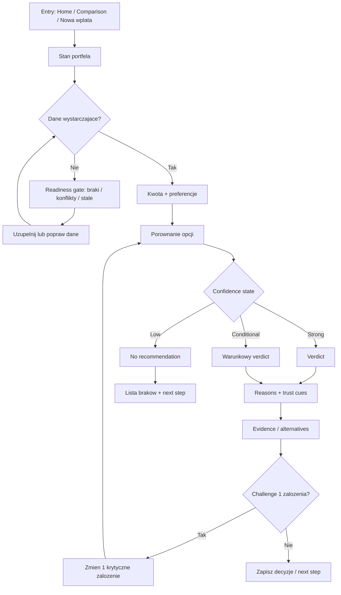
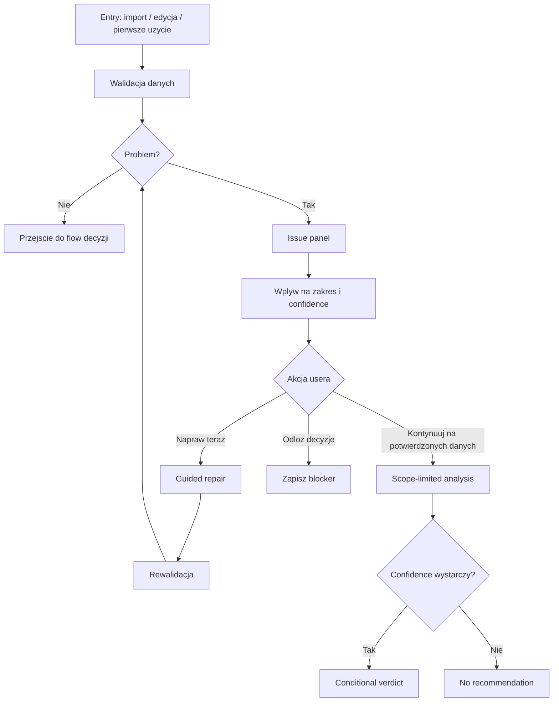
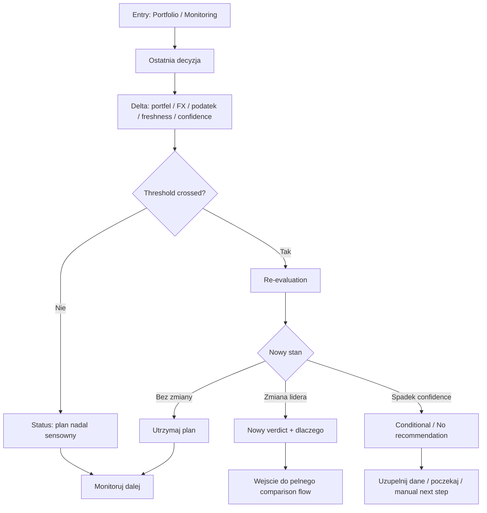
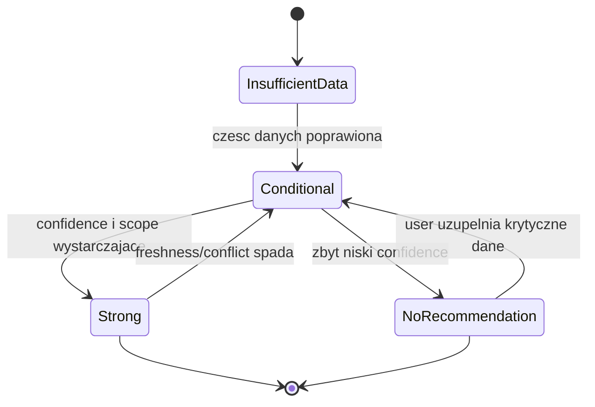

# Specyfikacja UX - Njord

**Autor:** Master
**Data:** 2026-05-11

---

<!-- Zawartosc specyfikacji UX bedzie dopisywana sekwencyjnie w kolejnych krokach workflow. -->

## Executive Summary

### Project Vision

Njord ma byc trust-first produktem decision-support dla polskiego inwestora indywidualnego. Z perspektywy UX jego podstawowym zadaniem jest skrocenie drogi od rozproszonego obrazu portfela do defensybilnej decyzji: co zrobic z nowa gotowka albo kolejna wplata w kontekscie obecnego portfela, podatku, FX i polskich alternatyw. Produkt nie ma tylko pokazywac danych - ma doprowadzic usera do jasnego nastepnego kroku albo uczciwie zakomunikowac, ze przy obecnych danych nie powinien dostac jednoznacznej rekomendacji.

Rdzen doswiadczenia musi laczyc spokojny flow decyzyjny z operacyjnie zdefiniowanym zaufaniem: widocznym pochodzeniem danych, ich swiezoscia, zakresem analizy, poziomem pewnosci i jawnym stanem no-recommendation tam, gdzie wynik nie jest obroniony. W dalszym rozwoju Njord moze budowac powod do regularnych powrotow przez monitoring zmian oraz scenariusze przyszlosci portfela, ale te elementy powinny rozszerzac rdzen, a nie rozmywac glownego job-to-be-done MVP.

### Target Users

Podstawowym userem jest polski inwestor self-directed o srednim poziomie zaawansowania, ktory sam podejmuje decyzje i nie chce skladac odpowiedzi z wielu narzedzi. Najczesciej korzysta z desktopu i mobile: po wyplacie, przy nowej wplacie, przy gwaltownych ruchach rynku albo wtedy, gdy chce szybko sprawdzic, czy jego obecny kierunek nadal ma sens.

Waznym segmentem jest tez user o niskiej tolerancji na blad - szczegolnie wyczulony na konflikty danych, brak kosztu nabycia, zbyt agresywne uproszczenia i brak transparentnosci. Dla tej osoby UX musi byc spokojny, uczciwy i bardzo czytelny w sytuacji niepewnosci, bo jedna zla lub przesadnie pewna rekomendacja moze zniszczyc zaufanie do produktu.

Istnieja tez stakeholderzy wewnetrzni, tacy jak ops i support, ktorzy potrzebuja traceability, widocznosci zalozen i sciezki odtworzenia wyniku. Nie sa oni jednak glownym target userem tej warstwy UX, lecz waznym kontekstem service-design i governance.

### Key Design Challenges

- Zaprojektowanie flow, ktory prowadzi do decyzji o nowej gotowce w kilka minut mimo wysokiej zlozonosci domeny: portfel, podatek, FX, polskie alternatywy, jakosc danych i rozne poziomy pewnosci.
- Zoperacjonalizowanie zaufania w interfejsie: user musi widziec zrodla danych, ich swiezosc, zakres analizy, zalozenia, poziom confidence oraz moment, w ktorym system celowo nie wydaje jednoznacznej rekomendacji.
- Utrzymanie czytelnej hierarchii informacji na desktopie i mobile, tak aby input friction, konflikty danych, porownania opcji i stany niepewnosci byly zrozumiale bez przeciążenia poznawczego, szczegolnie podczas stresujacych momentow rynkowych.

### Design Opportunities

- Zbudowanie trust-first decision canvas, w ktorym user dostaje jedna glowna odpowiedz, uzasadnienie, poziom pewnosci, nastepny krok i widoczne granice analizy bez potrzeby dalszego googlowania.
- Stworzenie recurring experience opartego o monitoring i scenariusze przyszlosci portfela, dzieki ktoremu Njord przestaje byc jednorazowym kalkulatorem i staje sie produktem, do ktorego warto wracac.
- Rozwiniecie portfolio-aware insight layer jako potencjalnej, pozniejszej warstwy eksploracyjnej - np. kontekstowych sygnalow lub raportow o spolkach, ktore user juz posiada - ale tylko tam, gdzie realnie wspiera to decyzje, zamiast odciagac uwage od core flow.

## Core User Experience

### Defining Experience

Rdzeniem doswiadczenia Njord ma byc szybka i wiarygodna odpowiedz na pytanie: w co najbardziej oplaca sie teraz zaalokowac gotowke. Core loop powinien zaczynac sie od mozliwie lekkiego zebrania minimalnego zestawu wejsc potrzebnych do decyzji - co najmniej kwoty nowej alokacji, obecnych pozycji lub ekspozycji oraz podstawowych zalozen decyzji - a konczyc jedna wiodaca opcja do rozważenia albo swiadomym brakiem rekomendacji z jasnym wyjasnieniem dlaczego.

To doswiadczenie nie moze udawac pewnosci. Jego zadaniem jest zamienic zlozonosc podatku, FX, jakosci danych i confidence w wynik, ktory jest czytelny, ograniczony jawnie zalozeniami i obroniony dowodowo. User nie powinien dostawac czarnej skrzynki ani "magicznej odpowiedzi"; powinien dostac najlepszy wynik przy aktualnych danych oraz wiedziec, co mogloby ten wynik zmienic.

### Platform Strategy

Njord pozostaje responsive web app, ale UX musi byc projektowany tak, aby bezpiecznie i czytelnie dzialal na mobile. Mobile powinien byc pierwszej klasy dla capture, szybkiego check-inu i konsumpcji odpowiedzi, natomiast desktop powinien byc uprzywilejowany dla glebszego porownania opcji, edycji zalozen i pelniejszego przejrzenia logiki wyniku.

Offline nie jest wymaganiem rdzeniowym. Kluczowe jest natomiast, aby web app dobrze radzila sobie w realnych warunkach uzycia: szybkie wejscie z telefonu, stresujacy moment rynkowy, slabsza jakosc polaczenia albo bardziej analityczna sesja na wiekszym ekranie. Platforma ma szybko liczyc podatek, FX i wynik, ale rownie wyraznie pokazywac swiezosc danych, loading, jakosc wejsc i granice pewnosci.

### Effortless Interactions

- Szybkie dodanie albo uzupelnienie obecnie otwartych pozycji, kwoty nowej alokacji i podstawowego kontekstu decyzji bez poczucia wypelniania ciezkiego formularza.
- Szybkie przeliczenie podatku, FX, confidence, brakow danych i porownania opcji z widocznym stanem swiezosci oraz loadingu, zamiast ukrywania niepewnosci pod pozorna natychmiastowoscia.
- Natychmiastowe zrozumienie, dlaczego dana opcja jest wiodaca: jakie zalozenia stoja za wynikiem, co ogranicza pewnosc i co mogloby zmienic odpowiedz.
- Latwa korekta jednego zalozenia i szybkie sprawdzenie, czy wynik nadal sie utrzymuje, bez koniecznosci przechodzenia calego flow od zera.
- Naturalna nawigacja na mobile: czytelna hierarchia, dotykowe kontrole i brak koniecznosci zoomowania lub walki z gestym ukladem danych.

### Critical Success Moments

Najwazniejszy moment sukcesu pojawia sie wtedy, gdy user po podaniu minimalnych danych dostaje jedna wiodaca opcje do rozważenia wraz z uzasadnieniem, swiezoscia zrodel, poziomem confidence, zalozeniami i jasnym sygnalem, co mogloby zmienic odpowiedz. To jest chwila, w ktorej produkt udowadnia, ze jest lepszy od recznego skladania decyzji z Excela, kursow i notatek.

Pierwsze zwyciestwo UX następuje takze wtedy, gdy nawet brak rekomendacji jest zrozumialy i uzyteczny: user wie, czego brakuje, dlaczego system sie wstrzymal i jaki jest nastepny krok. Make-or-break failure to zla albo zbyt pewna odpowiedz przy niepelnych danych, ukrycie gates zaufania albo taki chaos interfejsu, przez ktory user nie rozumie, skad wynik sie wzial.

### Experience Principles

- **One leading answer, never black box:** interfejs ma prowadzic do jednej wiodacej opcji albo swiadomego no-recommendation, ale zawsze z widocznym uzasadnieniem.
- **Trust before persuasion:** zrodla danych, swiezosc, confidence, zalozenia i ograniczenia musza byc widoczne zanim user zaufa wynikowi.
- **Automatyzuj matematyke, nie odbieraj sprawczosci:** produkt ma liczyc to, co zlozone, ale user musi rozumiec, co napedza wynik i zachowac kontrole nad decyzja.
- **Mobile-safe, desktop-deep:** mobile ma byc bezpieczny i czytelny dla szybkiej akcji, a desktop ma uniesc ciezar glebszej analizy.
- **No recommendation is a valid outcome:** UX ma chronic wiarygodnosc produktu nawet wtedy, gdy najlepsza odpowiedzia jest wstrzymanie werdyktu.

## Desired Emotional Response

### Primary Emotional Goals

Glownym celem emocjonalnym Njord ma byc nie tylko spokoj, ale **spokojna sprawczosc**: user ma czuc, ze podejmuje rozsadna decyzje bez paraliżu, bez presji i bez poczucia, ze cos istotnego mogl przeoczyc. Produkt ma redukowac chaos inwestycyjny, ale nie usypiac czujnosci; ma dawac uzasadniona pewnosc oparta na jawnych zalozeniach, a nie sztucznie pompowane confidence.

Drugim celem jest budowanie zaufania przez intelektualna uczciwosc. Njord ma sprawiac wrazenie narzedzia powaznego, kompetentnego i szanujacego inteligencje usera: niczego nie ukrywa, nie manipuluje tonem, nie wciska werdyktu na sile i nie udaje wiekszej pewnosci, niz faktycznie posiada. Emocjonalna przewaga ma wynikac z poczucia: "umiem obronic te decyzje przed samym soba, bo widze skad wynik sie bierze i gdzie sa jego granice".

Trzecim celem jest obniżenie potencjalnego zalu po decyzji. Nawet gdy wynik jest warunkowy albo prowadzi do braku rekomendacji, user ma czuc, ze produkt zachowal sie odpowiedzialnie i pomogl mu podjac nalezyta starannosc, a nie popchnal go w ryzyko.

### Emotional Journey Mapping

- **Pierwszy kontakt:** user powinien czuc, ze trafia do produktu powaznego, uporzadkowanego i nienalezacego do kategorii agresywnego fintech hype. Pierwsze wrazenie ma budowac spokoj, kompetencje i szacunek.
- **Wprowadzanie danych i ustawianie decyzji:** user ma czuc, ze rozumie co podaje, po co jest to potrzebne i ze nie zostanie ukarany za zlozonosc problemu. Formularz nie moze wzbudzac wstydu ani leku przed "zepsuciem" wyniku.
- **Otrzymanie wyniku:** user powinien czuc uzasadniona pewnosc - widzi wiodaca opcje albo brak rekomendacji, rozumie dlaczego, zna zalozenia, ograniczenia i to, co mogloby zmienic odpowiedz.
- **Gdy cos pojdzie nie tak:** user nadal ma czuc sie zaopiekowany i traktowany powaznie. Brak rekomendacji, konflikt danych lub chwilowy problem nie moze budowac poczucia porazki; ma budowac poczucie, ze system byl odpowiedzialny.
- **Przy powrocie:** returning user ma odzyskiwac orientacje szybko i bez wysilku. Emocjonalnie ma to byc powrot do znajomego, wiarygodnego narzedzia, a nie ponowne wejscie w chaos.

### Micro-Emotions

Najbardziej krytyczne mikro-emocje dla sukcesu Njord to:

- **Trust:** user musi czuc, ze produkt niczego nie ukrywa i nie prowadzi go manipulacyjnie do jednej odpowiedzi.
- **Calm:** interfejs i copy maja obnizac napiecie, szczegolnie przy stresie rynkowym i niepelnych danych.
- **Control:** user ma miec poczucie orientacji i sprawczosci bez przeciążenia poznawczego.
- **Clarity:** wynik, freshness, assumptions, confidence i ograniczenia musza byc zrozumiale bez dodatkowego wysilku.
- **Security:** produkt ma wzbudzac poczucie bezpieczenstwa danych, procesu i wyniku, szczegolnie przy decyzjach dotykajacych portfela i podatkow.
- **Composure under uncertainty:** user ma widziec, ze niepewnosc jest jawnie nazwana i nie odbiera mu godnosci ani mozliwosci podjecia rozsadnej decyzji.
- **Low-regret accomplishment:** po sesji user nie ma czuc triumfu, tylko domkniecie i przekonanie, ze podjal decyzje z nalezyta starannoscia.

Emocje, ktorych trzeba aktywnie unikac, to chaos, presja, poczucie manipulacji, falszywa pewnosc, wstyd wynikajacy z niezrozumienia produktu oraz poczucie, ze narzedzie popycha usera do ryzykownego ruchu.

### Design Implications

- **Spokojna sprawczosc** -> interfejs powinien prowadzic usera etapami, z jasna hierarchia i bez agresywnego tonu; ma dawac orientacje, nie euforie.
- **Zaufanie przez uczciwosc** -> zrodla danych, freshness, confidence, assumptions i ograniczenia musza byc widoczne przy wyniku, a nie schowane w stopkach lub dodatkowych ekranach.
- **Godnosc przy niepewnosci** -> no-recommendation, conflict states i slabsza jakosc danych musza byc komunikowane tak, aby user czul sie poinformowany i wsparty, a nie zawstydzony albo porzucony.
- **Niski potencjal zalu** -> wynik musi pokazywac nie tylko co prowadzi, ale tez dlaczego nie inne opcje, co mogloby zmienic odpowiedz i kiedy lepiej nie dzialac teraz.
- **Brak growth-hackowego tonu** -> design nie moze przypominac fintechowego leja sprzedazowego; zero urgency copy, zero sztucznej ekscytacji, zero pozornej celebracji wyniku.

### Emotional Design Principles

- **Buduj spokoj bez usypiania czujnosci:** produkt ma redukowac szum, ale nie wygładzac ryzyka i niepewnosci.
- **Jakosc buduje zaufanie:** user ma zaufac dlatego, ze produkt jest uczciwy, audytowalny i kompetentny, a nie dlatego, ze glosno obiecuje wynik.
- **Transparentnosc ponad perswazja:** lepiej pokazac granice odpowiedzi niz dopchnac usera do zbyt mocnego werdyktu.
- **Kazdy stan ma chronic relacje:** sukces, niepewnosc i blad powinny byc zaprojektowane tak, aby user czul sie szanowany i prowadzony.
- **Szanuj inteligencje usera:** Njord ma wspierac samodzielnego inwestora, nie infantylizowac go ani odbierac mu podmiotowosc.

## UX Pattern Analysis & Inspiration

### Inspiring Products Analysis

**Interactive Brokers** jest cenna inspiracja nie dlatego, ze Njord ma przypominac cockpit brokera, ale dlatego, ze komunikuje powage, kompletność i brak ukrytych warstw. Dla Njord najbardziej wartosciowe sa tu mechanizmy zaufania: widocznosc parametrów, jawne ograniczenia, timestampy i poczucie, ze nic istotnego nie zostalo schowane przed userem.

**XTB** wnosi lekcje, jak wygladac nowoczesnie i zaufanie budowac bez chaosu. W kontekscie Njord chodzi mniej o tradingowy charakter produktu, a bardziej o to, jak polaczyc powage z przystepnoscia: wejscie ma byc czytelne, uporzadkowane i nie moze wzbudzac leku, ze user juz na starcie ugrzeznie w zlozonosci.

**TradingView** jest najsilniejsza jako wzorzec warstwowania gestych danych i czytelnej analizy wizualnej. Dla Njord najwazniejsze sa tu patterny, w ktorych wykres i porownanie pomagaja zrozumiec decyzje, a nie tylko eksplorowac rynek dla samej eksploracji. Chart ma sluzyc interpretacji i trade-offom, nie pobudzaniu do tradingowego action bias.

Ten zestaw inspiracji jest trafny dla jezzyka interfejsu, ale nie powinien stac sie DNA zachowania produktu. Wszystkie trzy referencje niosa tradingowy rytm, dlatego Njord potrzebuje dodatkowo rownowagi w postaci bardziej instytucjonalnego archetypu high-trust utility - produktu, ktory bardziej wyjasnia decyzje niz zacheca do dzialania.

### Transferable UX Patterns

**Navigation Patterns**
- Najpierw werdykt, potem dowody, a dopiero potem glebsza metodologia i warstwa ekspercka.
- Stabilna struktura sekcji, w ktorej user zawsze wie, czy patrzy na wynik, assumptions, freshness, ograniczenia, czy dane pomocnicze.
- Powrot do kontekstu bez restartu calej sesji - szczegolnie wazny dla korekty zalozen i recurring use.

**Interaction Patterns**
- Jedna wiodaca opcja albo jawne no-recommendation na pierwszym planie, z mozliwoscia zejscia poziom nizej do confidence, assumptions, freshness i alternatyw.
- Chart i porownanie maja wyjasniac decyzje: co prowadzi, dlaczego prowadzi i co mogloby to odwrocic.
- Evidence drill-down: przy kluczowych liczbach user moze szybko zobaczyc zrodlo, swiezosc danych i ograniczenia bez opuszczania flow decyzji.

**Visual Patterns**
- Powaga i wiarygodnosc budowane przez spokojna hierarchie, a nie przez efekciarskosc lub agresywne CTA.
- Jasne rozdzielenie danych glownych od danych pomocniczych, aby ograniczenia byly widoczne, ale nie dewastowaly flow.
- Wysoka czytelnosc tabel, porownan i danych czasowych, szczegolnie tam, gdzie user musi zrozumiec relacje miedzy wynikiem, ryzykiem, podatkiem i FX.

### Anti-Patterns to Avoid

- Agresywne urgency copy, tradingowa dramaturgia i live-market energy, ktore sztucznie podbijaja emocje i sugeruja, ze zawsze trzeba wykonac ruch.
- Pseudo-gamifikacja, celebracyjny ton przy wyniku i growth-hackowy funnel, bo to oslabia wiarygodnosc trust-first produktu.
- Ukrywanie assumptions, freshness, confidence i ograniczen rekomendacji w tooltipach, stopkach lub drugorzednych ekranach.
- Surowe wykresy i gestosc danych bez warstwy interpretacji, co zamienialoby Njord w kolejny terminal zamiast decision-support product.
- Czerwono-zielona emocjonalizacja wyniku, ktora wzmacnia action bias zamiast spokojnej oceny trade-offow.

### Design Inspiration Strategy

**What to Adopt**
- Z Interactive Brokers: jawność parametrow, timestampow i ograniczen - poczucie, ze nic istotnego nie jest ukryte.
- Z XTB: czytelny, zaufany punkt wejscia do zlozonego tematu bez infantylizacji usera.
- Z TradingView: warstwowanie analizy, silna hierarchia informacji i wykresy, ktore wspieraja interpretacje.

**What to Adapt**
- Gestosc danych i analityczna glebia trzeba dostosowac do trust-first decision flow, a nie kopiowac 1:1 z platform tradingowych.
- Patterny wykresow, paneli i porownan trzeba podporzadkowac pytaniu "co prowadzi i dlaczego", zamiast wspierac eksploracje dla samej eksploracji.
- Powage i eksperckosc trzeba zbalansowac z prostota dla self-directed investora, ktory chce podjac decyzje, a nie obslugiwac terminal.

**What to Avoid**
- Wszystko, co wnosi tradingowy action bias: urgency copy, przesadna live-ness, manipulacyjne CTA i celebracje wyniku.
- Patterny, ktore chowaja granice rekomendacji albo zmniejszaja widocznosc assumptions, freshness i confidence.
- Interfejsy tak gestymi danymi, ze niszcza spokojna sprawczosc i poczucie kontroli.

Njord powinien wiec pozyczac od referencji wiarygodnosc, czytelnosc i warstwowanie informacji, ale swiadomie odciac sie od ich tradingowego tempa i logiki konwersyjnej. Inspiracja ma sluzyc budowie produktu, ktory wyjasnia i broni decyzje, a nie pobudza do ruchu.

## Design System Foundation

### 1.1 Design System Choice

Dla Njord wybranym kierunkiem jest **token-first internal UI foundation on Tailwind v4**. W praktyce oznacza to semantyczne tokeny projektowe definiowane w `@theme`, ograniczony zestaw wewnetrznych prymitywow oraz kuratorowana biblioteke wzorcow dla krytycznych przeplywow trust-first. To nie jest pelna zewnetrzna biblioteka komponentow, nie jest tez pelny custom design system budowany jak osobny produkt. To maly, zamierzony system wewnetrzny pod wiarygodnosc, spojnosc i niski koszt utrzymania.

### Rationale for Selection

- Obecny stack Njord juz opiera sie na Tailwind v4, utility classes i semantycznych tokenach, wiec ten wybor wzmacnia naturalny fundament repo zamiast go obchodzic.
- Priorytety projektu to balans, niski maintenance cost i ograniczona gotowosc do utrzymywania rozbudowanego DS. Pelny custom system bylby zbyt drogi, a ciezka zewnetrzna biblioteka zbyt latwo narzucilaby obcy jezyk interfejsu i zla abstrakcje dla trust-first fintechu.
- Njord potrzebuje rozpoznawalnego, spokojnego jezyka wizualnego, ale nie wymaga multi-theme engine ani rozbudowanego theming API. Tokenizacja ma umozliwiac ewolucje, a nie generowac dodatkowy koszt od pierwszego dnia.
- Najwieksza wartosc systemu nie lezy w liczbie komponentow, tylko w jakosci trust states, czytelnosci tabel i wykresow oraz spojnosc wzorcow takich jak no-recommendation, evidence drill-down i comparison modules.

### Implementation Approach

System powinien byc budowany w trzech warstwach:

- **Tokens** - decyzje fundacyjne: kolory semantyczne, typografia, spacing, border, surface, states, chart semantics.
- **Primitives** - maly zestaw bazowych elementow UI, np. Button, Input, Select, Card, Alert, Table shell, Tabs, Modal albo Drawer.
- **Patterns** - wzorce domenowe wysokiego zaufania, np. comparison block, evidence drill-down, trust panel, no-recommendation state, confidence state, structured form sections.

Rollout powinien byc kontraktowy, nie mglisty: **foundation -> primitives -> high-trust patterns -> reszta**. Najpierw nalezy ustabilizowac tokeny, typografie, surfaces i zasady chart/table readability. Potem dopiero budowac prymitywy, a nastepnie najwazniejsze patterny produktowe dla porownan, alerts, stale data, evidence i no-recommendation.

### Customization Strategy

Customization w Njord nie polega na theme'owaniu cudzej biblioteki, tylko na konsekwentnym budowaniu wlasnego jezyka poprzez tokeny, hierarchie typograficzna, spacing rules i zestaw wzorcow dla decision-support fintech. W praktyce oznacza to:

- jeden glowny motyw teraz, z tokenizacja przygotowujaca grunt pod przyszla ewolucje,
- brak ambicji budowy publicznego theming API lub pelnego enterprise DS,
- priorytet dla trust cues, source disclosure, freshness, assumptions i confidence over decorative flexibility,
- ograniczenie variants do tych, ktore sa realnie potrzebne produktowi.

Governance systemu powinien byc proste i twarde:

- nic nie trafia do systemu, dopoki nie powtorzy sie w co najmniej 3 miejscach,
- preferowany jest pattern nad nowy komponent, a nowy komponent nad kolejny wariant,
- nowe warianty powinny byc limitowane do maksimum 2-3 na prymityw, o ile nie ma silnego uzasadnienia produktowego,
- trust states, tables i chart treatments sa first-class citizens systemu, nie dodatkiem na koncu.

Njord powinien wiec rozwijac wlasny, wewnetrzny system interfejsu ewolucyjnie i pragmatycznie: wystarczajaco spójny, by budowac zaufanie, ale wystarczajaco maly, by nie zamienic sie w osobny kosztowny projekt utrzymaniowy.

## Defining Interaction Details

### Defining Experience

Defining experience Njord nie polega tylko na tym, ze user dostaje wynik. Polega na tym, ze po dodaniu kontekstu portfela i nowej gotowki produkt wydaje **werdykt z granica zaufania**: pokazuje jedna wiodaca opcje albo swiadomie odmawia rekomendacji, mowi dlaczego, czego mu brakuje i co mogloby zmienic odpowiedz. To jest interakcja, ktora user powinien umiec opisac znajomemu bez tlumaczenia calej architektury produktu.

Jesli ten flow zostanie dopracowany, reszta Njord stanie sie jego rozszerzeniem. Monitoring, scenariusze i dalsze insighty nie beda osobnymi osiami produktu, tylko kolejnymi warstwami wokol tego samego experience contract: produkt pomaga podjac decyzje, ale nie udaje wiekszej pewnosci, niz faktycznie posiada.

### User Mental Model

Dzis user rozwiazuje ten problem przez reczne skladanie odpowiedzi z kilku zrodel: brokera, kursow FX, notatek, Excela, kalkulatorow podatkowych i wlasnej intuicji. Mentalnie oczekuje od Njord, ze produkt sklei te fragmenty za niego i odda jedna sensowna odpowiedz z wyjasnieniem, na ile mozna jej ufac.

Najwieksze punkty frustracji nie biora sie tylko z braku wyniku, ale z niepewnosci: jakie dane sa potrzebne, czy dane sa dobrej jakosci, jak rozumiec confidence i dlaczego jedna opcja prowadzi nad inna. Dlatego defining experience musi zmniejszac nie tylko liczbe krokow, ale tez liczbe niezamknietych watpliwosci.

### Success Criteria

Core interaction dziala wtedy, gdy user bez recznego liczenia i bez skakania po innych narzedziach dostaje odpowiedz, ktora rozumie i umie obronic. Kluczowe przeliczenia i feedback musza byc odczuwalnie szybkie, ale najwazniejsze jest to, ze wynik nie jest czarna skrzynka i nie konczy sie arbitralnym rankingiem bez kontekstu.

**Success indicators:**
- user przechodzi od podania minimalnych danych do werdyktu w kilka minut,
- system automatycznie liczy podatek, FX, porownanie opcji, freshness, confidence i wplyw brakow danych,
- wynik zawsze konczy sie jedna wiodaca opcja albo no-recommendation wraz z assumptions, freshness, top powodami i jasnym nastepnym krokiem,
- user widzi nie tylko co prowadzi, ale tez co mogloby odwrocic werdykt.

### Novel UX Patterns

To nie jest novel interaction w sensie nowego gestu czy nieznanego modelu sterowania. Rdzen Njord powinien byc zbudowany z established patterns: wprowadzanie danych, card-based verdict, porownanie opcji, drill-down do szczegolow i korekta zalozen. Unikalnosc polega na tym, jak te wzorce sa polaczone w jeden trust-first kontrakt decyzyjny.

Twist Njord polega na czterech rzeczach: readiness gate, no-recommendation jako pelnoprawny wynik, evidence drill-down jako naturalna czesc rozumienia werdyktu oraz pokazanie "what could change the answer" jako first-class information. To nie wymaga uczenia usera nowego zachowania, ale daje mu nowa jakosc decyzji.

### Experience Mechanics

**1. Initiation**
- User zaczyna od dodania swoich otwartych pozycji oraz, jesli ma wolna gotowke, wpisania kwoty nowej alokacji.
- Punkt wejscia powinien byc prosty i czytelny: portfel + nowa gotowka + uruchomienie porownania decyzji.

**2. Readiness gate**
- Zanim produkt wyda finalny werdykt, jasno komunikuje poziom gotowosci odpowiedzi: mamy dosc danych na werdykt, mamy tylko kierunek warunkowy albo nie mozemy uczciwie rekomendowac.
- Jesli danych brakuje, system wskazuje konkretnie czego i jaki ma to koszt dla zaufania do wyniku.

**3. Verdict**
- System pokazuje jeden jednozdaniowy werdykt: co dzis prowadzi albo dlaczego no-recommendation jest uczciwszym wynikiem.
- Zaraz pod werdyktem user widzi 2-3 najwazniejsze powody: np. podatek, FX, koszt wejscia, przewidywany wynik netto lub plynnosc.

**4. Challenge and feedback**
- Produkt pokazuje najwazniejsza niepewnosc lub punkt przelamania: co musialoby sie zmienic, zeby lider przestal byc liderem.
- User moze poprawic ten jeden krytyczny element i szybko zobaczyc, czy werdykt sie utrzyma.
- Loading, missing-data states i conflict states nie sa tylko higiena UI, ale jawna czescia kontraktu zaufania.

**5. Completion**
- Flow jest domkniety, gdy user widzi wiodaca opcje albo no-recommendation, rozumie dlaczego, zna assumptions, freshness, confidence i wie, jaki jest nastepny krok.
- User wychodzi z poczuciem, ze nie tylko dostal odpowiedz, ale tez wie, czego system nie wie i co mogloby zmienic decyzje.

## Visual Design Foundation

### Color System

Njord powinien zachowac obecny brand jako punkt wyjscia, ale uporzadkowac go wokol trust-first semantics zamiast przypadkowej palety ekranow. Kolor glowny powinien pozostac stonowany, wiarygodny i analityczny - z rola brand / neutral-financial anchor, a nie marketingowego akcentu. System kolorow ma wspierac przede wszystkim czytelnosc, confidence i interpretacje danych, nie budowac tradingowej ekscytacji.

Strategia kolorystyczna powinna opierac sie na trzech warstwach:
- **neutralne surface + text tokens** dla spokojnego, profesjonalnego tla,
- **brand / accent tokens** do sygnalizacji glownego kierunku i aktywnych elementow,
- **financial semantic tokens** dla profit / loss / warning / neutral oraz chart colors.

Kolory powinny byc mapowane semantycznie, nie dekoracyjnie. Zielony i czerwony nie moga byc traktowane jako ozdoba ani dramaturgia; musza sluzyc interpretacji finansowej. Warstwa wizualna powinna unikac gradientow, neonowych akcentow i przesadnie nasyconych kontrastow, bo to oslabia spokojna sprawczosc i zaufanie. Priorytetem jest bardzo wysoka czytelnosc i kontrast, szczegolnie dla tabel, comparison blocks, alerts, stale data states i confidence indicators.

### Typography System

Typografia powinna zostac oparta na **system fonts / neutral sans**, bo najlepiej wspiera profesjonalny, nowoczesny i wysokoczytelny charakter produktu bez dokladania kosztu brandowego overdesignu. Njord nie potrzebuje wyrazistego font personality kosztem czytelnosci; potrzebuje stabilnej, przewidywalnej typografii, ktora dobrze dziala w dense financial UI na desktopie i mobile.

Hierarchia tekstu powinna byc jednoznaczna i konserwatywna:
- mocne, czytelne naglowki dla verdictow, sekcji i comparison modules,
- neutralny body text o wysokiej czytelnosci dla assumptions, explanations i alerts,
- wyrazne style dla metadata, freshness, confidence i source disclosure,
- ograniczona liczba wag i rozmiarow, aby nie rozmywac hierarchii.

Typografia ma komunikowac profesjonalizm, spokoj i analityczna precyzje. Lepiej zbudowac rozpoznawalnosc przez spojnosc hierarchy, spacing i alignment niz przez charakterystyczny font, ktory moglby oslabic czytelnosc.

### Spacing & Layout Foundation

Njord powinien uzywac **hybrid 4/8 rhythm**: 4px dla mikro-spacingu i doprecyzowania gestych ekranow, 8px jako glowny rytm sekcji, blokow i pionowej hierarchii. Ten model najlepiej odpowiada balanced density - produkt ma byc gesty informacyjnie, ale nie przytlaczajacy.

Layout powinien byc mobile-first, ale nie mobile-only. Oznacza to:
- na mobile: jedna glowna kolumna z bardzo czytelnym flow verdict -> reasons -> trust cues -> drill-down,
- na desktopie: uklad pozwalajacy na glebsze porownanie i rownolegly widok verdictu, argumentow i evidence,
- grid powinien wspierac hierarchie informacji, a nie dekoracyjna symetrie.

Spacing musi wspierac rozroznienie miedzy danymi glownymi, pomocniczymi i ostrzezeniami. Kluczowym celem nie jest "duzo powietrza", tylko przewidywalny porzadek, szybkie skanowanie i zachowanie spokoju poznawczego nawet przy duzej gestosci danych.

### Accessibility Considerations

Warstwa wizualna Njord powinna byc projektowana z **very high accessibility priority**. Oznacza to:
- kontrast tekstu i elementow UI ma byc traktowany jako twardy wymog, nie kosmetyka,
- typografia i layout maja byc czytelne przy dluzszych wyjasnieniach, tabelach i stanach niepewnosci,
- kolory nie moga byc jedynym nosnikiem znaczenia, szczegolnie dla profit/loss, confidence i alerts,
- mobile readability musi byc oceniana rownie rygorystycznie jak desktop,
- stale data, missing data, no-recommendation i conflict states musza miec wyrazna warstwe wizualna bez popadania w alarmistyczny ton.

Accessibility w Njord nie jest dodatkiem, tylko czescia trust contract. Jesli user nie moze szybko i bezblednie odczytac wyniku, assumptions albo ograniczen, to produkt przestaje byc wiarygodny niezaleznie od poprawnosci silnika obliczeniowego.

## Design Direction Decision

### Design Directions Explored

W ramach eksploracji powstalo szesc kierunkow wizualnych, z ktorych trzy okazaly sie najblizsze potrzebom Njord:

- **Verdict First Stack** jako najczystszy model hierarchii verdict -> reasons -> trust cues -> drill-down.
- **Split Evidence Desk** jako najmocniejszy kierunek dla desktopowego porownania opcji, evidence i analitycznej glebii bez zamiany produktu w trading terminal.
- **Guided Decision Rail** jako najbardziej przyjazny dla prowadzenia usera przez input, readiness gate i nastepny krok.

Pozostale kierunki byly wartosciowe eksploracyjnie, ale nie powinny stanowic glownego shellu produktu na tym etapie. Analytical Ledger jest zbyt data-dense jako domyslny rytm produktu, Scenario Canvas zbyt mocno przesuwa akcent w strone scenariuszy, a Trust Console lepiej traktowac jako zrodlo wzorcow dla trust states niz jako glowna architekture ekranu.

### Chosen Direction

Wybranym kierunkiem roboczym dla Njord jest **hybryda 1 + 2 + 3**:

- **1 / Verdict First Stack** jako baza informacji i glowny shell produktu,
- **2 / Split Evidence Desk** jako wzorzec desktopowego regionu evidence, comparison i glebszego reasoning,
- **3 / Guided Decision Rail** jako inspiracja dla flow wejscia, readiness gate i framingu kolejnego kroku.

W praktyce oznacza to, ze Njord nie bedzie ani czystym wizardem, ani gestym terminalem analitycznym. Domyslny interfejs ma najpierw dawac jedna czytelna odpowiedz lub no-recommendation, potem najwazniejsze powody i trust contract, a dopiero nizej lub obok glebsza warstwe evidence i porownania.

### Design Rationale

Ta hybryda najlepiej odpowiada wczesniej zdefiniowanemu characterowi produktu:

- wspiera **one leading answer, never black box**, bo verdict pozostaje na pierwszym planie,
- utrzymuje **mobile-safe, desktop-deep**, bo glowny rytm jest prosty na mobile, a desktop dostaje osobny region na dowody i porownanie,
- obniza input friction, bo elementy z Guided Decision Rail pomagaja prowadzic usera przez minimalny zestaw danych zamiast wrzucac go od razu w gesty ekran,
- chroni trust-first contract, bo readiness, freshness, confidence, assumptions i no-recommendation pozostaja first-class information, a nie dodatkiem.

Najwazniejsze jest to, ze ta decyzja nie zamyka produktu w jednym stylistycznym tropie. To fundament architektoniczny dla szczegolowych journey i ekranow: najpierw werdykt, potem dowody, z czytelnym prowadzeniem usera przez wejscie i warunki zaufania.

### Implementation Approach

W kolejnych krokach UX i UI ten kierunek powinien byc tlumaczony na konkretne reguly:

- **mobile shell:** jedna kolumna verdict -> top reasons -> trust cues -> next step -> optional drill-down,
- **desktop shell:** layout z dominujacym verdict panelem oraz rownoleglym regionem evidence / comparison,
- **input flow:** sekcje prowadzone, kontraktowe i lekkie poznawczo; user ma wiedziec, jakie dane sa wymagane, opcjonalne i dlaczego,
- **trust states:** readiness, missing data, stale data, confidence i no-recommendation musza miec stale, rozpoznawalne wzorce wizualne,
- **charts and comparisons:** maja wyjasniac decyzje i trade-offy, nie tworzyc tradingowej dramaturgii,
- **component strategy:** verdict card, reasons block, trust panel, evidence drill-down i comparison modules powinny stac sie kandydatami na pierwsze high-trust patterns w wewnetrznym systemie UI.

## User Journey Flows

### 1. Nowa wplata -> decyzja alokacji

**Cel:** doprowadzic usera od nowej gotowki do jednej defensybilnej decyzji albo jawnego no-recommendation.

**Niezmienne reguly:**
- readiness gate zawsze przed werdyktem,
- wynik = jedna wiodaca opcja albo no-recommendation,
- trust cues musza byc blisko wyniku: confidence, freshness, assumptions, evidence.

### 2. Konflikt danych / niski confidence

**Cel:** chronic zaufanie, gdy dane sa niepelne albo niespojne.

**Niezmienne reguly:**
- kazdy problem pokazuje wplyw na confidence,
- user zawsze widzi najkrotsza droge naprawy,
- slaby wynik nie moze udawac mocnej rekomendacji.

### 3. Powrot / monitoring poprzedniej decyzji

**Cel:** szybko odpowiedziec, czy poprzedni werdykt nadal stoi i co sie zmienilo.

**Niezmienne reguly:**
- ekran powrotu zaczyna od delta vs poprzedni baseline,
- brak zmiany tez jest wartosciowym wynikiem,
- monitoring ma wywolywac akcje tylko po realnym progu zmiany.

### Confidence & Decision States

### Journey Patterns

- **Verdict-first hierarchy:** verdict -> reasons -> trust cues -> drill-down
- **Readiness before answer:** system najpierw ocenia, czy moze uczciwie odpowiedziec
- **One-variable challenge loop:** user testuje wynik zmiana 1 krytycznego zalozenia
- **No recommendation as product behavior:** to nie blad, tylko uczciwy outcome
- **Return without restart:** monitoring odzyskuje kontekst bez skladania flow od zera

### Visual Placeholder Guidance

Na etapie UI warto doszkicowac tylko 5 key frames:
1. readiness gate,
2. strong verdict,
3. conditional verdict,
4. issue panel dla konfliktu danych,
5. monitoring delta panel.

### Flow Optimization Principles

- minimalny input -> readiness -> verdict,
- progressive disclosure zamiast dlugich opisow ekranow,
- uncertainty komunikowana wczesnie, nie w stopce,
- mobile-safe capture, desktop-deep evidence,
- kazdy blocker musi miec sensowny next step.

## Component Strategy

### Design System Components

**Foundation z wewnetrznego systemu UI:**
- Button
- Input / numeric input
- Select
- Card
- Alert
- Table shell
- Tabs
- Modal / Drawer

**Czego to nie pokrywa samo z siebie:**
- verdictu z poziomem pewnosci,
- readiness gate przed wynikiem,
- trust cues jako stalego modulu,
- porownania lidera vs alternatywy,
- guided repair dla brakow i konfliktow danych,
- monitoringu delta vs poprzedni baseline.

**Wniosek:** Njord powinien skladac UI z malych prymitywow, ale budowac wlasne komponenty domenowe tam, gdzie chodzi o zaufanie, decyzje i interpretacje wyniku.

### Custom Components

### Verdict Card

**Purpose:** pokazuje glowny outcome flow: strong verdict, conditional verdict albo no-recommendation.  
**Usage:** pierwszy blok po readiness gate i po kazdym przeliczeniu.  
**Anatomy:** status badge, jednozdaniowy werdykt, 2-3 top reasons, next step CTA, optional caution note.  
**States:** loading, strong, conditional, no-recommendation, stale-data.  
**Variants:** compact mobile, expanded desktop.  
**Accessibility:** naglowek sekcji, `aria-live="polite"` przy zmianie wyniku, focus target po przeliczeniu.  
**Interaction Behavior:** klik w reasons lub CTA prowadzi do comparison/evidence bez gubienia kontekstu.

### Readiness Gate

**Purpose:** komunikuje, czy system moze uczciwie wydac werdykt.  
**Usage:** zawsze przed pokazaniem decyzji, gdy dane sa niepelne, konfliktowe lub stare.  
**Anatomy:** readiness label, lista blockerow, wplyw na confidence, next repair action.  
**States:** ready, partial, blocked.  
**Variants:** inline panel, dismiss-free blocking state.  
**Accessibility:** lista blockerow jako prawdziwa lista, jednoznaczne komunikaty statusu, klawiaturowy dostep do akcji naprawczych.  
**Interaction Behavior:** prowadzi usera do konkretnej naprawy zamiast ogolnego bledu.

### Trust Panel

**Purpose:** spina confidence, freshness, assumptions i provenance w jeden modul zaufania.  
**Usage:** obok verdictu, warunkowego wyniku i monitoringu.  
**Anatomy:** confidence state, freshness timestamp, assumptions summary, sources link.  
**States:** complete, partial, degraded.  
**Variants:** inline summary, expandable details.  
**Accessibility:** znaczenie nie oparte tylko na kolorze; czytelne etykiety dla confidence i freshness.  
**Interaction Behavior:** rozwiniecie pokazuje szczegoly bez wyrzucania usera z flow decyzji.

### Comparison Module

**Purpose:** porownuje lidera z alternatywami w formie decision-support, nie trading terminala.  
**Usage:** po verdict card jako druga warstwa decyzji.  
**Anatomy:** lider, alternatywy, kluczowe metryki netto, tagi ryzyka / plynnosci / podatku, link do evidence.  
**States:** full-data, partial-data, compact-mobile.  
**Variants:** stacked cards na mobile, table-like desk na desktop.  
**Accessibility:** logiczna kolejnosc czytania, wyrazne naglowki kolumn/sekcji, brak znaczenia opartego tylko na kolorze.  
**Interaction Behavior:** user moze zejsc glebiej w evidence albo challenge jednego zalozenia.

### Data Issue Panel

**Purpose:** obsluguje braki, konflikty i niespojnosci danych bez utraty zaufania.  
**Usage:** import, edycja portfela, readiness gate, monitoring z problemami danych.  
**Anatomy:** typ problemu, zakres wplywu, confidence impact, recommended repair path.  
**States:** info, warning, blocking, resolved.  
**Variants:** inline callout, drawer z guided repair.  
**Accessibility:** komunikaty musza byc zrozumiale bez ikon i koloru; stany resolved czytelne dla screen readera.  
**Interaction Behavior:** user wybiera: napraw teraz, kontynuuj na potwierdzonych danych, odloz decyzje.

### Monitoring Delta Panel

**Purpose:** pokazuje, co zmienilo sie od ostatniego baseline'u i czy wymaga nowej decyzji.  
**Usage:** returning-user flow i monitoring.  
**Anatomy:** delta summary, threshold state, recommendation status, next step.  
**States:** stable, threshold-crossed, confidence-down, stale-data.  
**Variants:** summary strip, expanded analysis card.  
**Accessibility:** zmiany opisane tekstowo, nie tylko strzalkami lub kolorem.  
**Interaction Behavior:** prowadzi do maintain / re-evaluate / wait.

### Component Implementation Strategy

- foundation zostaje male: prymitywy + tokeny, bez rozrostu wariantow,
- wszystko domenowe skladamy z foundation components, nie budujemy nowej warstwy abstrakcji,
- statusy musza byc wspolne w calym produkcie: strong / conditional / no-recommendation / blocked,
- Drawer na mobile, side panel lub inline expansion na desktop dla evidence i repair details,
- nowy komponent trafia do systemu dopiero, gdy sluzy co najmniej 3 miejscom albo chroni trust contract,
- pattern > nowy komponent, nowy komponent > nowy wariant.

### Implementation Roadmap

**Phase 1 - Core decision components**
- Readiness Gate
- Verdict Card
- Trust Panel
- Comparison Module

**Phase 2 - Recovery and monitoring components**
- Data Issue Panel
- Monitoring Delta Panel

**Phase 3 - Deeper detail surfaces**
- Evidence Drawer / detail surface
- bardziej zaawansowane challenge controls dla scenariuszy i assumptions

## UX Consistency Patterns

### Button Hierarchy

**When to Use:**
- **Primary button** tylko dla glownej akcji danego kroku: `Porownaj`, `Przelicz`, `Zapisz decyzje`
- **Secondary button** dla akcji pomocniczych: `Zmien zalozenia`, `Zobacz szczegoly`
- **Tertiary / text action** dla mniej krytycznych przejsc: `Pokaz zrodla`, `Rozwin evidence`
- **Destructive action** tylko przy usuwaniu danych lub resetach, nigdy obok glownego CTA decyzji

**Avoid When:**
- nie dawac dwoch rownorzednych primary CTA w jednym panelu,
- nie oznaczac ryzyka samym kolorem przycisku,
- nie uzywac destructive jako domyslnej akcji szybkiego flow.

**Action Safety:**
- jedna primary action na ekran / panel,
- destructive zawsze secondary + potwierdzenie,
- przy ryzykownym kroku user musi widziec efekt akcji przed wykonaniem.

**Visual Design:**
- jedna wizualnie dominujaca akcja na ekran / panel,
- primary nie moze konkurowac z wieloma rownorzednymi CTA,
- status decision-support nie moze byc kodowany przyciskiem; przycisk uruchamia akcje, ale verdict komunikuje osobny komponent.

**Behavior:**
- primary disabled tylko wtedy, gdy user realnie nie moze isc dalej; obok musi byc powod,
- po przeliczeniu focus wraca na verdict / readiness gate, nie gubi usera nizej na stronie,
- akcje poboczne nie resetuja calego flow, jesli da sie utrzymac kontekst.

**Accessibility:**
- jasne etykiety akcji, nie same ikony,
- focus visible zawsze mocny,
- disabled state nie moze byc jedynym komunikatem o problemie.

**Mobile Considerations:**
- primary CTA sticky tylko tam, gdzie user jest nisko w flow i zna konsekwencje,
- przy dlugich formularzach jedna glowna akcja na viewport.

### Feedback Patterns

**When to Use:**
- **Success:** user zakonczyl akcje bez ryzyka interpretacyjnego, np. zapis decyzji
- **Info:** neutralny kontekst, np. freshness, source notes
- **Warning:** confidence spada, dane sa czesciowe, ale flow moze isc dalej warunkowo
- **Error / Blocking:** nie mozna uczciwie pokazac wyniku albo akcja nie zostala wykonana
- **No-recommendation:** osobny pattern produktowy, nie zwykly error

**Avoid When:**
- nie uzywac toastow dla krytycznych komunikatow decyzji,
- nie mieszac bledu technicznego z brakiem rekomendacji.

**Visual Design:**
- feedback ma rosnaca sile: info -> warning -> blocking,
- no-recommendation wizualnie odroznione od bledu technicznego,
- wszystkie statusy maja tytul, konsekwencje i next step.

**Behavior:**
- kazdy warning mowi: co sie stalo, jaki wplyw, co teraz,
- system preferuje jawne opoznienie / brak rekomendacji nad mylacy sukces,
- feedback po przeliczeniu powinien byc blisko verdictu, nie w toastach poza kontekstem.

**Accessibility:**
- komunikaty musza byc zrozumiale bez koloru,
- wazne zmiany wyniku i blocking states oglaszane przez live region.

**Mobile Considerations:**
- najwazniejszy feedback inline, nie ukryty w top-level banerze poza viewportem.

### Form Patterns

**When to Use:**
- wejscia finansowe, preferencje decyzji, uzupelnianie brakow, guided repair

**Avoid When:**
- nie budowac szerokich, gestych formularzy, gdy ten sam cel mozna osiagnac sekcjami krokowymi.

**Visual Design:**
- formularze dzielone na male sekcje: portfel, nowa gotowka, preferencje, ograniczenia,
- required vs optional widoczne od razu,
- pola finansowe z jasna jednostka: PLN, %, miesiace, lata.

**Behavior:**
- walidacja inline po blur lub po probie kontynuacji, nie agresywnie na kazdy znak,
- user moze zapisac czesciowy postep i wrocic do korekty,
- przy bledzie system prowadzi do konkretnego pola lub konfliktu, nie do ogolnego alertu,
- jedna zmiana zalozenia powinna moc wywolac szybki re-run bez restartu calego flow.

**Accessibility:**
- label zawsze jawny,
- helper text powiazany programowo z polem,
- bledy w podsumowaniu + przy konkretnym polu.

**Mobile Considerations:**
- numeric input musi byc wygodny kciukiem,
- grupy pol nie moga tworzyc szerokich tabel wymagajacych scrolla poziomego.

### Navigation Patterns

**When to Use:**
- przechodzenie miedzy stronami, sekcjami analizy, drill-down i monitoringiem

**Avoid When:**
- nie przenosic usera na nowy ekran tylko po to, by pokazac pomocniczy detal.

**Visual Design:**
- route-level navigation dla glownych obszarow produktu,
- local section navigation dla glebszych warstw: evidence, comparison, assumptions,
- user zawsze widzi, czy jest w: input, verdict, detail, monitoring.

**Behavior:**
- drill-down nie moze kasowac kontekstu verdictu ani inputow,
- powrot z details wraca do tego samego miejsca i stanu,
- mobile preferuje expansion / drawer zamiast pelnych skokow miedzy ekranami dla pomocniczych detali.

**Accessibility:**
- logiczna kolejnosc naglowkow i landmarkow,
- aktywny stan nawigacji czytelny tekstowo, nie tylko kolorem.

**Mobile Considerations:**
- jedna glowna kolumna; detale w drawerach lub akordeonach,
- desktop moze miec verdict + evidence rownolegle.

### Additional Patterns

**Modal / Drawer Patterns**
- Modal tylko dla potwierdzen lub malej liczby decyzji
- Drawer dla evidence, zrodel, guided repair i dodatkowych szczegolow
- nic krytycznego dla zrozumienia werdyktu nie moze byc ukryte tylko w modalu

**Loading / Empty / No-Data Patterns**
- loading zawsze pokazuje zakres: co sie liczy lub odswieza
- empty state ma prowadzic do pierwszej sensownej akcji
- no-data i no-recommendation to dwa rozne stany
- kazdy pattern ma domyslny wariant oraz fallback dla braku danych

**No-Recommendation Pattern**
- zawiera: powod, confidence impact, czego brakuje, co user moze zrobic teraz
- nie brzmi alarmistycznie ani wstydzaco
- musi byc traktowany jak pelnoprawny outcome flow

**Tables and Dense Data**
- gestosc danych tylko tam, gdzie wspiera decyzje
- mobile: stacked summaries; desktop: table-like comparison
- zrodla, freshness i assumptions dostepne bez opuszczania flow

## Responsive Design & Accessibility

### Responsive Strategy

**Desktop Strategy**
- desktop jest trybem analitycznym: verdict siedzi obok evidence / comparison
- dla szerokich ekranow priorytet ma rownolegly widok: wynik, trust cues, porownanie, drill-down
- szerokosc sluzy redukcji przelaczania kontekstu, nie dekoracji

**Tablet Strategy**
- tablet domyslnie zostaje w jednej kolumnie
- split layout pojawia sie tylko wtedy, gdy realnie poprawia czytelnosc comparison / evidence
- dotyk pozostaje first-class; nie kopiujemy desktopu 1:1

**Mobile Strategy**
- mobile first dla: wejsc, monitoringu, szybkiego check-inu i interpretacji werdyktu
- po akcji krytycznej mobile pokazuje najpierw: **verdict, 2-3 kluczowe powody, trust cues i next step**
- szczegoly, porownanie i wykresy sa domyslnie zwiniete, ale dostepne bez utraty kontekstu
- nic krytycznego dla decyzji nie moze byc ukryte pod foldem po przeliczeniu

### Breakpoint Strategy

**Podejscie:** mobile-first, standardowe breakpointy zgodne z prostym systemem UI.

- **Mobile:** 320-639 px -> jedna kolumna, stacked modules, drawers dla detali
- **Tablet:** 640-1023 px -> jedna kolumna + opcjonalny split dla evidence / comparison
- **Desktop:** 1024-1279 px -> verdict + evidence/comparison w dwoch regionach
- **Wide desktop:** 1280+ px -> split evidence desk, wieksza gestosc porownan bez utraty czytelnosci

**Regula:** layout zmienia sie tylko wtedy, gdy poprawia zrozumienie decyzji.

### Accessibility Strategy

**Poziom docelowy:** WCAG 2.2 AA jako twardy baseline dla core product flow.

**Kluczowe wymagania:**
- kontrast tekstu i statusow zgodny z AA
- pelna obsluga klawiatura dla core flow
- focus management po przeliczeniu, otwarciu drawerow i zamknieciu overlay
- touch targets min. 44x44 px
- znaczenie nigdy nie moze opierac sie tylko na kolorze
- no-recommendation, warning i blocking states musza byc czytelne dla screen readera
- reflow musi pozostac czytelny przy 200% zoom
- motion optional: animacje nie moga byc wymagane do zrozumienia stanu

**Charts, tables, dense data**
- wykres nigdy nie jest jedynym nosnikiem wniosku; obok musi byc tekstowy takeaway
- tabela / comparison na mobile musi miec stacked summary albo czytelny horizontal scroll z tekstowym opisem
- screen reader musi miec droge do summary, kluczowych metryk i znaczenia wyniku
- waluty, procenty, daty i jednostki zawsze jawnie opisane

### Testing Strategy

**Responsive Testing**
- testy na realnych viewportach mobile / tablet / desktop dla core routes
- sprawdzenie flow: input -> verdict -> evidence -> monitoring
- testy przy slabszym laczu i przy dluzszym loadingu danych
- testy po przeliczeniu: czy verdict i trust cues zostaja nad foldem

**Accessibility Testing**
- automated scan dla regresji podstawowych naruszen
- keyboard-only walkthrough dla glownego flow decyzyjnego
- screen reader smoke test dla verdictu, alertow, formularzy, tabel i drawerow
- kontrast i zoom test dla gestych porownan i tabel

**Acceptance Focus**
- user zawsze wie, gdzie jest, co sie zmienilo i co moze zrobic dalej
- brak rekomendacji ma byc tak samo dostepny i czytelny jak mocny werdykt
- mobile nie moze chowac verdictu i trust cues pod foldem po interakcji krytycznej

### Implementation Guidelines

- mobile-first media queries
- semantic HTML + poprawne landmarks i heading structure
- focus wraca w przewidywalne miejsce po akcjach modal/drawer/recalculate
- drawer na mobile, inline/side-panel na desktop dla evidence i repair details
- unikac poziomego scrolla w core flow; jesli tabela musi byc szeroka, daj stacked summary albo tekstowy fallback
- jednostki, waluty, procenty i daty zawsze jawnie opisane
- live regions tylko dla zmian istotnych; bez gadatliwosci screen readera
- charts i comparison modules musza miec tekstowy summary variant
