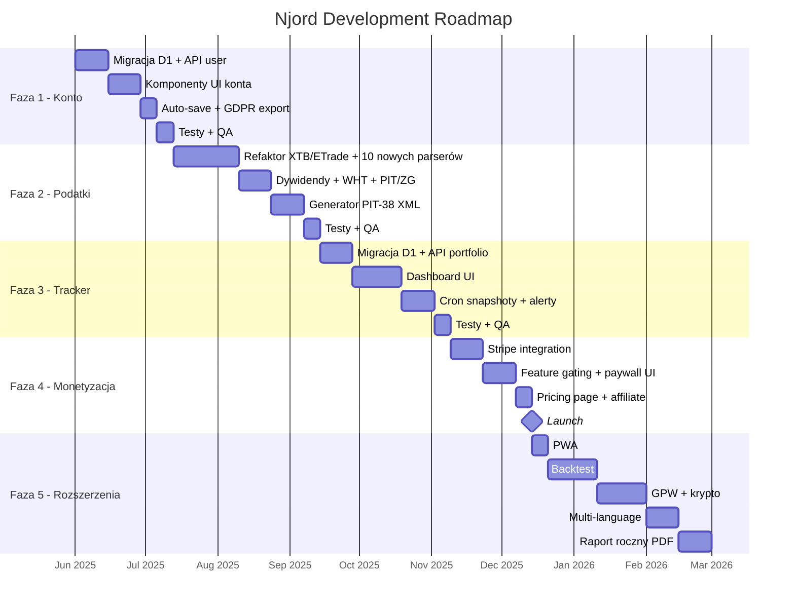

# Njord — Plan Rozwoju Aplikacji

> **Repozytorium:** `github.com/SunBear1/Njord`
> **Deployment:** `njord.pages.dev`
> **Stack:** React 19 + TypeScript + Vite + Cloudflare Pages Functions + D1
> **Cel:** Przekształcenie kalkulatora inwestycyjnego w pełnoprawny produkt SaaS dla polskich inwestorów indywidualnych

---

## Spis treści

1. [Kontekst i obecny stan](#1-kontekst-i-obecny-stan)
2. [Faza 1 — Konto użytkownika i zapisywanie danych (4-6 tygodni)](#2-faza-1--konto-użytkownika-i-zapisywanie-danych)
3. [Faza 2 — Rozbudowa kalkulatora podatkowego (6-8 tygodni)](#3-faza-2--rozbudowa-kalkulatora-podatkowego)
4. [Faza 3 — Portfolio Tracker i dashboard (6-8 tygodni)](#4-faza-3--portfolio-tracker-i-dashboard)
5. [Faza 4 — Monetyzacja i skalowanie (4-6 tygodni)](#5-faza-4--monetyzacja-i-skalowanie)
6. [Faza 5 — Zaawansowane funkcje i integracje (ongoing)](#6-faza-5--zaawansowane-funkcje-i-integracje)
7. [Architektura docelowa](#7-architektura-docelowa)
8. [Schemat bazy danych D1 — nowe tabele](#8-schemat-bazy-danych-d1--nowe-tabele)
9. [Priorytety i zależności](#9-priorytety-i-zaleznosci)
10. [Metryki sukcesu](#10-metryki-sukcesu)

---

## 1. Kontekst i obecny stan

### Istniejące moduły

| Moduł | Route | Status |
|---|---|---|
| Comparison (obligacje vs akcje vs konto) | `/comparison` | ✅ Działa |
| Forecast (Monte Carlo + HMM) | `/forecast` | ✅ Działa |
| Belka Tax Calculator (XTB + E\*Trade) | `/tax` | ✅ Działa |
| Portfolio Builder (IKE/IKZE) | `/portfolio` | ✅ Działa |
| Rates (kursy walut) | `/rates` | ✅ Działa |
| Auth (JWT + OAuth) | `/api/auth/*` | ✅ Backend gotowy, brak funkcji za logowaniem |

### Istniejąca infrastruktura

- **Backend:** Cloudflare Pages Functions (edge, serverless)
- **Baza danych:** Cloudflare D1 (SQLite — obecnie tylko auth)
- **Cache:** 1h dla market data, 24h dla obligacji i inflacji
- **Testy:** 500+ unit (Vitest) + E2E (Playwright)
- **CI/CD:** GitHub → Cloudflare Pages (auto-deploy na `main`)

### Istniejące API endpoints

```
/api/market-data      — Yahoo Finance + Twelve Data + NBP FX
/api/bonds            — presets z CSV, cache 24h
/api/currency-rates   — Alior Kantor + NBP Table C
/api/inflation        — HICP z ECB, cache 24h
/api/auth/*           — JWT + OAuth (GitHub, Google)
```

### Główny konkurent

**PodatekGiełdowy.pl** — obsługuje 14 brokerów (DEGIRO, Revolut, IBKR, Exante, eToro, Trading 212, Freedom24, Tastytrade, XTB, eMAKLER/mBank, Binance, Coinbase, Zonda, Lightyear), 15 000+ użytkowników. Przygotowuje dane do PIT-38 i PIT/ZG. Kalkulator Njord ma przewagę w: porównaniu obligacji vs akcji, forecaście Monte Carlo + HMM, portfolio builderze IKE/IKZE, i danych live (kursy, inflacja). Aby konkurować na rynku podatkowym, Njord musi osiągnąć parytet w obsłudze brokerów.

**KalkulatorGiełdowy.pl** — kolejny konkurent, obsługuje podobny zestaw brokerów z importem CSV/XLSX.

### Stan parserów brokerów w kalkulatorze Belki

| Broker | Status | Format |
|---|---|---|
| E\*Trade | ✅ Istniejący | XLSX |
| XTB | ✅ Istniejący | CSV |
| Interactive Brokers | ❌ Brak | CSV/XLSX (Activity Statement) |
| Revolut | ❌ Brak | CSV (Rachunek Zysków i Strat) |
| Degiro | ❌ Brak | CSV (Account Statement) |
| eToro | ❌ Brak | XLSX (Account Statement) |
| Trading 212 | ❌ Brak | CSV |
| mBank eMakler | ❌ Brak | CSV |
| Exante | ❌ Brak | XLSX |
| Freedom24 | ❌ Brak | XLSX |
| Tastytrade | ❌ Brak | CSV |
| Lightyear | ❌ Brak | CSV |

---

## 2. Faza 1 — Konto użytkownika i zapisywanie danych (4-6 tygodni)

**Cel:** Dać użytkownikowi powód do zalogowania się — persystencja danych między sesjami.

### 2.1 Migracja bazy danych D1

Utwórz plik `migrations/0002_user_data.sql`:

```sql
-- Zapisane portfele użytkownika
CREATE TABLE IF NOT EXISTS user_portfolios (
    id TEXT PRIMARY KEY DEFAULT (lower(hex(randomblob(16)))),
    user_id TEXT NOT NULL REFERENCES users(id) ON DELETE CASCADE,
    name TEXT NOT NULL DEFAULT 'Mój portfel',
    data TEXT NOT NULL, -- JSON: alokacja, parametry symulacji
    module TEXT NOT NULL CHECK (module IN ('comparison', 'forecast', 'portfolio', 'tax')),
    created_at TEXT NOT NULL DEFAULT (datetime('now')),
    updated_at TEXT NOT NULL DEFAULT (datetime('now'))
);

CREATE INDEX idx_portfolios_user ON user_portfolios(user_id, module);

-- Zapisane transakcje podatkowe (progressive entry)
CREATE TABLE IF NOT EXISTS tax_transactions (
    id TEXT PRIMARY KEY DEFAULT (lower(hex(randomblob(16)))),
    user_id TEXT NOT NULL REFERENCES users(id) ON DELETE CASCADE,
    tax_year INTEGER NOT NULL,
    ticker TEXT NOT NULL,
    transaction_type TEXT NOT NULL CHECK (transaction_type IN ('buy', 'sell', 'dividend')),
    quantity REAL NOT NULL,
    price_usd REAL NOT NULL,
    price_pln REAL,
    nbp_rate REAL,
    nbp_rate_date TEXT,
    transaction_date TEXT NOT NULL,
    broker TEXT DEFAULT 'manual',
    source_file TEXT,
    created_at TEXT NOT NULL DEFAULT (datetime('now'))
);

CREATE INDEX idx_tax_user_year ON tax_transactions(user_id, tax_year);

-- Ustawienia użytkownika
CREATE TABLE IF NOT EXISTS user_settings (
    user_id TEXT PRIMARY KEY REFERENCES users(id) ON DELETE CASCADE,
    default_currency TEXT NOT NULL DEFAULT 'PLN',
    default_broker TEXT DEFAULT NULL,
    notification_preferences TEXT DEFAULT '{}',
    theme TEXT NOT NULL DEFAULT 'system',
    updated_at TEXT NOT NULL DEFAULT (datetime('now'))
);
```

### 2.2 Nowe API endpoints

Utwórz Pages Functions w katalogu `functions/api/`:

```
functions/api/
├── user/
│   ├── portfolios.ts          — GET (list), POST (create)
│   ├── portfolios/[id].ts     — GET, PUT, DELETE
│   ├── settings.ts            — GET, PUT
│   └── export.ts              — GET (eksport danych użytkownika — GDPR)
├── tax/
│   ├── transactions.ts        — GET (list by year), POST (create/batch)
│   ├── transactions/[id].ts   — GET, PUT, DELETE
│   ├── import.ts              — POST (import XLSX)
│   └── summary.ts             — GET (podsumowanie PIT-38 per rok)
```

**Middleware autentykacji** — utwórz `functions/api/_middleware.ts`:

```typescript
import { verifyJWT } from '../auth/jwt-utils';

export const onRequest: PagesFunction<Env> = async (context) => {
    const authHeader = context.request.headers.get('Authorization');
    if (!authHeader?.startsWith('Bearer ')) {
        return new Response(JSON.stringify({ error: 'Unauthorized' }), {
            status: 401,
            headers: { 'Content-Type': 'application/json' },
        });
    }

    const token = authHeader.slice(7);
    try {
        const payload = await verifyJWT(token, context.env.JWT_SECRET);
        context.data.userId = payload.sub;
        return context.next();
    } catch {
        return new Response(JSON.stringify({ error: 'Invalid token' }), {
            status: 401,
            headers: { 'Content-Type': 'application/json' },
        });
    }
};
```

### 2.3 Frontend — komponenty konta

Utwórz nowe komponenty w `src/`:

```
src/
├── features/
│   └── account/
│       ├── AccountPage.tsx            — /account route, profil użytkownika
│       ├── SavedPortfolios.tsx        — lista zapisanych portfeli/symulacji
│       ├── SavePortfolioDialog.tsx    — modal zapisu bieżącej konfiguracji
│       ├── LoadPortfolioDialog.tsx    — modal wczytywania zapisanej konfiguracji
│       └── UserSettings.tsx           — preferencje (waluta, broker, motyw)
├── hooks/
│   ├── useAuth.ts                     — kontekst autentykacji (rozszerzyć istniejący)
│   ├── useSavedPortfolios.ts          — CRUD dla zapisanych portfeli
│   └── useAutoSave.ts                 — debounced auto-save bieżącej konfiguracji
├── components/
│   └── SaveLoadToolbar.tsx            — pasek narzędzi "Zapisz | Wczytaj | Udostępnij"
```

**Kluczowe zadania implementacyjne:**

1. **Dodaj `<SaveLoadToolbar />` do każdego modułu** — przycisk "Zapisz konfigurację" widoczny tylko dla zalogowanych
2. **Dodaj route `/account`** — strona profilu z listą zapisanych portfeli pogrupowanych per moduł
3. **Implementuj `useAutoSave` hook** — automatyczny zapis co 30 sekund (debounced) do D1
4. **Dodaj banner zachęcający do logowania** — na każdym module dla niezalogowanych
5. **Eksport danych (GDPR)** — endpoint `/api/user/export` zwraca JSON ze wszystkimi danymi

### 2.4 Testy

```
- src/features/account/__tests__/AccountPage.test.tsx
- src/features/account/__tests__/SavedPortfolios.test.tsx
- src/hooks/__tests__/useSavedPortfolios.test.ts
- src/hooks/__tests__/useAutoSave.test.ts
- functions/api/user/__tests__/portfolios.test.ts
- functions/api/tax/__tests__/transactions.test.ts
- e2e/account.spec.ts
```

---

## 3. Faza 2 — Rozbudowa kalkulatora podatkowego (6-8 tygodni)

**Cel:** Uczynić kalkulator Belki najlepszym narzędziem do rozliczania zagranicznych inwestycji w Polsce.

### 3.1 Obsługa wielu brokerów

Utwórz system parserów w `src/features/tax/parsers/`:

```
src/features/tax/parsers/
├── index.ts                        — broker detection + registry
├── types.ts                        — wspólny interfejs ParsedTransaction
├── etrade-parser.ts                — ✅ ISTNIEJĄCY — refaktoryzacja do wspólnego interfejsu
├── xtb-parser.ts                   — ✅ ISTNIEJĄCY — refaktoryzacja do wspólnego interfejsu
├── interactive-brokers-parser.ts   — [NEW] IB Activity Statement (CSV/XLSX)
├── revolut-parser.ts               — [NEW] Revolut stocks statement (CSV)
├── degiro-parser.ts                — [NEW] Degiro Account Statement (CSV)
├── mbank-parser.ts                 — [NEW] mBank eMakler (CSV)
├── exante-parser.ts                — [NEW] Exante transactions (XLSX)
├── etoro-parser.ts                 — [NEW] eToro Account Statement (XLSX)
├── trading212-parser.ts            — [NEW] Trading 212 (CSV)
├── freedom24-parser.ts             — [NEW] Freedom24 transactions (XLSX)
├── tastytrade-parser.ts            — [NEW] Tastytrade history (CSV)
├── lightyear-parser.ts             — [NEW] Lightyear transactions (CSV)
└── manual-parser.ts                — [NEW] ręczne wprowadzanie (formularz)
```

**Wspólny interfejs:**

```typescript
// src/features/tax/parsers/types.ts

export interface ParsedTransaction {
    date: string;                    // ISO 8601
    type: 'buy' | 'sell' | 'dividend' | 'fee' | 'withholding_tax';
    ticker: string;
    isin?: string;
    quantity: number;
    pricePerUnit: number;            // w walucie oryginalnej
    currency: string;                // ISO 4217
    totalAmount: number;
    fee?: number;
    withholdingTax?: number;         // podatek pobrany u źródła (np. US 15%)
    broker: string;
    rawRow?: Record<string, string>; // oryginalny wiersz do debugowania
}

export interface BrokerParser {
    name: string;
    supportedFormats: ('csv' | 'xlsx')[];
    detect(file: File): Promise<boolean>;
    parse(file: File): Promise<ParsedTransaction[]>;
}
```

**Auto-detekcja brokera:**

```typescript
// src/features/tax/parsers/index.ts

// Istniejące parsery (refaktoryzacja do wspólnego interfejsu BrokerParser)
import { etrade } from './etrade-parser';
import { xtb } from './xtb-parser';

// Nowe parsery
import { interactiveBrokers } from './interactive-brokers-parser';
import { revolut } from './revolut-parser';
import { degiro } from './degiro-parser';
import { mbank } from './mbank-parser';
import { exante } from './exante-parser';
import { etoro } from './etoro-parser';
import { trading212 } from './trading212-parser';
import { freedom24 } from './freedom24-parser';
import { tastytrade } from './tastytrade-parser';
import { lightyear } from './lightyear-parser';

const PARSERS: BrokerParser[] = [
    // Istniejące (zrefaktoryzowane)
    etrade, xtb,
    // Nowe — priorytet wg popularności w Polsce
    interactiveBrokers, revolut, degiro, etoro, trading212,
    mbank, exante, freedom24, tastytrade, lightyear,
];

export async function detectAndParse(file: File): Promise<{
    broker: string;
    transactions: ParsedTransaction[];
}> {
    for (const parser of PARSERS) {
        if (await parser.detect(file)) {
            const transactions = await parser.parse(file);
            return { broker: parser.name, transactions };
        }
    }
    throw new Error(
        'Nie rozpoznano formatu pliku. Obsługiwane: E*Trade, XTB, IB, Revolut, ' +
        'Degiro, eToro, Trading 212, mBank, Exante, Freedom24, Tastytrade, Lightyear.'
    );
}
```

### 3.2 Obsługa dywidend i podwójnego opodatkowania

Utwórz `src/features/tax/dividend-tax.ts`:

```typescript
export interface DividendTaxResult {
    grossDividendUSD: number;
    grossDividendPLN: number;
    withholdingTaxUSD: number;
    withholdingTaxPLN: number;
    polishTaxDue: number;            // 19% od kwoty brutto w PLN
    foreignTaxCredit: number;        // zaliczenie podatku zagranicznego
    netTaxDuePLN: number;            // polishTaxDue - foreignTaxCredit
    nbpRate: number;
    nbpRateDate: string;
    requiresPitZG: boolean;
}

export const WHT_RATES: Record<string, number> = {
    US: 0.15,    // z W-8BEN
    IE: 0.25,    // Irlandia (ETFy Vanguard)
    DE: 0.2638,  // Niemcy
    GB: 0.00,    // UK — brak WHT na dywidendy
    NL: 0.15,    // Holandia
};

export function calculateDividendTax(params: {
    grossDividendUSD: number;
    withholdingTaxUSD: number;
    nbpRate: number;
    nbpRateDate: string;
    sourceCountry: string;
}): DividendTaxResult {
    const grossPLN = params.grossDividendUSD * params.nbpRate;
    const withholdingPLN = params.withholdingTaxUSD * params.nbpRate;
    const polishTax = Math.round(grossPLN * 0.19 * 100) / 100;

    // Metoda proporcjonalnego odliczenia (art. 30a ust. 9 ustawy o PIT)
    const foreignCredit = Math.min(withholdingPLN, polishTax);
    const netTax = Math.max(0, polishTax - foreignCredit);

    return {
        grossDividendUSD: params.grossDividendUSD,
        grossDividendPLN: grossPLN,
        withholdingTaxUSD: params.withholdingTaxUSD,
        withholdingTaxPLN: withholdingPLN,
        polishTaxDue: polishTax,
        foreignTaxCredit: foreignCredit,
        netTaxDuePLN: netTax,
        nbpRate: params.nbpRate,
        nbpRateDate: params.nbpRateDate,
        requiresPitZG: true,
    };
}
```

### 3.3 Generowanie PIT-38 XML

Utwórz `src/features/tax/pit38-xml-generator.ts`:

```typescript
export interface PIT38Data {
    taxpayer: {
        pesel: string;
        firstName: string;
        lastName: string;
        dateOfBirth: string;
    };
    taxYear: number;
    income: {
        c_revenue: number;       // Przychód (pole 20)
        c_costs: number;         // Koszty uzyskania przychodu (pole 21)
        c_income: number;        // Dochód (pole 22) lub strata (pole 23)
    };
    foreignIncome?: {
        d_revenue: number;
        d_costs: number;
        d_income: number;
        d_foreignTaxPaid: number;
        country: string;         // Kod kraju ISO
    };
    taxCalculation: {
        totalIncome: number;     // Pole 29
        taxDue: number;          // 19% — pole 30
        foreignTaxCredit: number;// Pole 31
        taxToPay: number;        // Pole 32
    };
}

export function generatePIT38XML(data: PIT38Data): string {
    // WAŻNE: Schema PIT-38 zmienia się co rok podatkowy.
    // Pobierz aktualną XSD: https://www.podatki.gov.pl/e-deklaracje/dokumentacja-it/
    const version = data.taxYear >= 2025 ? '17' : '16';
    const incomeField = data.income.c_income >= 0
        ? `<P_22>${data.income.c_income.toFixed(2)}</P_22>`
        : `<P_23>${Math.abs(data.income.c_income).toFixed(2)}</P_23>`;

    return `<?xml version="1.0" encoding="UTF-8"?>
<Deklaracja xmlns="http://crd.gov.pl/wzor/${data.taxYear}/12/3171/">
  <Naglowek>
    <KodFormularza kodSystemowy="PIT-38 (${version})"
                   kodPodatku="PIT" rodzajZobowiazania="Z"
                   wersjaSchemy="1-0E">PIT-38</KodFormularza>
    <WariantFormularza>${version}</WariantFormularza>
    <CelZlozenia poz="P_6">1</CelZlozenia>
    <Rok>${data.taxYear}</Rok>
  </Naglowek>
  <Podmiot1 rola="Podatnik">
    <OsobaFizyczna>
      <PESEL>${data.taxpayer.pesel}</PESEL>
      <ImiePierwsze>${data.taxpayer.firstName}</ImiePierwsze>
      <Nazwisko>${data.taxpayer.lastName}</Nazwisko>
      <DataUrodzenia>${data.taxpayer.dateOfBirth}</DataUrodzenia>
    </OsobaFizyczna>
  </Podmiot1>
  <PozycjeSzczegolowe>
    <P_20>${data.income.c_revenue.toFixed(2)}</P_20>
    <P_21>${data.income.c_costs.toFixed(2)}</P_21>
    ${incomeField}
    <P_29>${data.taxCalculation.totalIncome.toFixed(2)}</P_29>
    <P_30>${data.taxCalculation.taxDue.toFixed(2)}</P_30>
    <P_31>${data.taxCalculation.foreignTaxCredit.toFixed(2)}</P_31>
    <P_32>${data.taxCalculation.taxToPay.toFixed(2)}</P_32>
  </PozycjeSzczegolowe>
</Deklaracja>`;
}

export function generatePITZGXML(data: PIT38Data): string | null {
    if (!data.foreignIncome) return null;
    const version = data.taxYear >= 2025 ? '8' : '7';

    return `<?xml version="1.0" encoding="UTF-8"?>
<Deklaracja xmlns="http://crd.gov.pl/wzor/${data.taxYear}/12/3172/">
  <Naglowek>
    <KodFormularza kodSystemowy="PIT/ZG (${version})"
                   wersjaSchemy="1-0E">PIT/ZG</KodFormularza>
    <WariantFormularza>${version}</WariantFormularza>
    <CelZlozenia>1</CelZlozenia>
    <Rok>${data.taxYear}</Rok>
  </Naglowek>
  <PozycjeSzczegolowe>
    <P_1>${data.foreignIncome.country}</P_1>
    <P_2>${data.foreignIncome.d_revenue.toFixed(2)}</P_2>
    <P_3>${data.foreignIncome.d_costs.toFixed(2)}</P_3>
    <P_4>${data.foreignIncome.d_income.toFixed(2)}</P_4>
    <P_5>${data.foreignIncome.d_foreignTaxPaid.toFixed(2)}</P_5>
  </PozycjeSzczegolowe>
</Deklaracja>`;
}
```

### 3.4 Kurs NBP — rozszerzone API

Rozszerz `functions/api/nbp-rate.ts`:

```typescript
// GET /api/nbp-rate?date=2025-03-14&currency=USD
// Zwraca kurs z Tabeli A NBP z dnia POPRZEDNIEGO roboczego
// (wymagany przez ustawę o PIT do przeliczania transakcji zagranicznych)

export interface NBPRateResponse {
    currency: string;
    rate: number;
    effectiveDate: string;
    table: string;
    transactionDate: string;
}
```

### 3.5 Nowe komponenty UI

```
src/features/tax/components/
├── BrokerFileUpload.tsx        — drag & drop z auto-detekcją brokera
├── TransactionTable.tsx        — edytowalna tabela (rozszerzyć istniejącą)
├── DividendSection.tsx         — sekcja dywidend z kalkulacją WHT
├── PIT38Preview.tsx            — podgląd wypełnionego PIT-38
├── PIT38ExportButton.tsx       — "Pobierz XML do e-Deklaracji"
├── PITZGPreview.tsx            — podgląd załącznika PIT/ZG
├── YearSelector.tsx            — przełączanie między latami podatkowymi
└── ProgressiveEntryBanner.tsx  — "Dodawaj transakcje w ciągu roku"
```

### 3.6 Testy

```
Pliki testowe:
- src/features/tax/parsers/__tests__/etrade-parser.test.ts       (istniejący — rozszerzyć o BrokerParser interface)
- src/features/tax/parsers/__tests__/xtb-parser.test.ts          (istniejący — rozszerzyć o BrokerParser interface)
- src/features/tax/parsers/__tests__/interactive-brokers-parser.test.ts  [NEW]
- src/features/tax/parsers/__tests__/revolut-parser.test.ts              [NEW]
- src/features/tax/parsers/__tests__/degiro-parser.test.ts               [NEW]
- src/features/tax/parsers/__tests__/etoro-parser.test.ts                [NEW]
- src/features/tax/parsers/__tests__/trading212-parser.test.ts           [NEW]
- src/features/tax/parsers/__tests__/mbank-parser.test.ts                [NEW]
- src/features/tax/parsers/__tests__/exante-parser.test.ts               [NEW]
- src/features/tax/parsers/__tests__/freedom24-parser.test.ts            [NEW]
- src/features/tax/parsers/__tests__/tastytrade-parser.test.ts           [NEW]
- src/features/tax/parsers/__tests__/lightyear-parser.test.ts            [NEW]
- src/features/tax/parsers/__tests__/broker-detection.test.ts            [NEW]
- src/features/tax/__tests__/dividend-tax.test.ts                        [NEW]
- src/features/tax/__tests__/pit38-xml-generator.test.ts                 [NEW]
- src/features/tax/__tests__/pitzg-xml-generator.test.ts                 [NEW]
- e2e/tax-import-multibroker.spec.ts                                     [NEW]
- e2e/tax-pit38-export.spec.ts                                           [NEW]

Fixtures:
- src/features/tax/parsers/__fixtures__/ib-activity-statement.csv
- src/features/tax/parsers/__fixtures__/revolut-stocks.csv
- src/features/tax/parsers/__fixtures__/xtb-transactions.csv      (istniejący)
- src/features/tax/parsers/__fixtures__/degiro-account.csv
- src/features/tax/parsers/__fixtures__/etoro-account-statement.xlsx
- src/features/tax/parsers/__fixtures__/trading212-history.csv
- src/features/tax/parsers/__fixtures__/freedom24-transactions.xlsx
- src/features/tax/parsers/__fixtures__/tastytrade-history.csv
- src/features/tax/parsers/__fixtures__/lightyear-transactions.csv
```

---

## 4. Faza 3 — Portfolio Tracker i dashboard (6-8 tygodni)

**Cel:** Przekształcić jednorazowy kalkulator w narzędzie codziennego użytku.

### 4.1 Migracja bazy danych

Utwórz `migrations/0003_portfolio_tracker.sql`:

```sql
CREATE TABLE IF NOT EXISTS portfolio_positions (
    id TEXT PRIMARY KEY DEFAULT (lower(hex(randomblob(16)))),
    user_id TEXT NOT NULL REFERENCES users(id) ON DELETE CASCADE,
    portfolio_id TEXT NOT NULL REFERENCES user_portfolios(id) ON DELETE CASCADE,
    ticker TEXT NOT NULL,
    isin TEXT,
    asset_type TEXT NOT NULL CHECK (asset_type IN (
        'stock', 'etf', 'bond_gov', 'bond_corp', 'crypto', 'savings', 'cash'
    )),
    quantity REAL NOT NULL DEFAULT 0,
    avg_buy_price REAL NOT NULL,
    avg_buy_price_pln REAL NOT NULL,
    currency TEXT NOT NULL DEFAULT 'USD',
    account_type TEXT NOT NULL CHECK (account_type IN ('standard', 'ike', 'ikze')) DEFAULT 'standard',
    broker TEXT,
    notes TEXT,
    created_at TEXT NOT NULL DEFAULT (datetime('now')),
    updated_at TEXT NOT NULL DEFAULT (datetime('now'))
);

CREATE INDEX idx_positions_portfolio ON portfolio_positions(portfolio_id);
CREATE INDEX idx_positions_user ON portfolio_positions(user_id);

CREATE TABLE IF NOT EXISTS portfolio_snapshots (
    id TEXT PRIMARY KEY DEFAULT (lower(hex(randomblob(16)))),
    user_id TEXT NOT NULL REFERENCES users(id) ON DELETE CASCADE,
    portfolio_id TEXT NOT NULL REFERENCES user_portfolios(id) ON DELETE CASCADE,
    date TEXT NOT NULL,
    total_value_pln REAL NOT NULL,
    total_value_usd REAL,
    usd_pln_rate REAL,
    positions_json TEXT NOT NULL,
    created_at TEXT NOT NULL DEFAULT (datetime('now'))
);

CREATE UNIQUE INDEX idx_snapshots_date ON portfolio_snapshots(portfolio_id, date);

CREATE TABLE IF NOT EXISTS user_alerts (
    id TEXT PRIMARY KEY DEFAULT (lower(hex(randomblob(16)))),
    user_id TEXT NOT NULL REFERENCES users(id) ON DELETE CASCADE,
    alert_type TEXT NOT NULL CHECK (alert_type IN (
        'price_above', 'price_below', 'fx_above', 'fx_below',
        'portfolio_drop_pct', 'portfolio_gain_pct', 'rebalance_drift'
    )),
    ticker TEXT,
    threshold REAL NOT NULL,
    is_active INTEGER NOT NULL DEFAULT 1,
    last_triggered_at TEXT,
    created_at TEXT NOT NULL DEFAULT (datetime('now'))
);

CREATE INDEX idx_alerts_user ON user_alerts(user_id, is_active);
```

### 4.2 Nowe API endpoints

```
functions/api/portfolio/
├── positions.ts           — GET, POST, PUT, DELETE
├── positions/import.ts    — POST (reuse parserów z Fazy 2)
├── snapshot.ts            — POST (Cron Trigger)
├── performance.ts         — GET (XIRR, total return, P&L)
└── alerts.ts              — GET, POST, PUT, DELETE
```

**Cloudflare Cron Trigger** — dodaj do `wrangler.toml`:

```toml
[triggers]
crons = ["0 18 * * 1-5"]  # Pon-Pt o 18:00 UTC (po zamknięciu NYSE)
```

Utwórz `functions/scheduled.ts`:

```typescript
// Cron handler: codziennie po zamknięciu rynku
// 1. Pobierz aktualne ceny dla unikalnych tickerów
// 2. Pobierz kurs USD/PLN
// 3. Utwórz snapshot dla każdego aktywnego portfela
// 4. Sprawdź alerty i wyślij notyfikacje (Cloudflare Email Workers)

export default {
    async scheduled(event: ScheduledEvent, env: Env, ctx: ExecutionContext) {
        // implementacja...
    }
};
```

### 4.3 Dashboard UI

```
src/features/dashboard/
├── DashboardPage.tsx              — /dashboard (wymaga auth)
├── components/
│   ├── PortfolioValueCard.tsx     — wartość portfela PLN + USD
│   ├── DailyChangeCard.tsx        — zmiana dzienna (%, PLN)
│   ├── AllocationPieChart.tsx     — alokacja per typ/ticker
│   ├── PerformanceChart.tsx       — wykres wartości w czasie (Recharts)
│   ├── PositionsTable.tsx         — tabela pozycji z P&L
│   ├── RebalancingWidget.tsx      — odchylenie od target alokacji
│   ├── TaxSummaryWidget.tsx       — szacunkowy podatek do zapłaty
│   ├── AlertsPanel.tsx            — lista alertów
│   └── FXImpactWidget.tsx         — wpływ kursu walutowego
├── hooks/
│   ├── usePortfolioValue.ts
│   ├── useXIRR.ts                 — stopa zwrotu ważona przepływami
│   └── useRebalanceCheck.ts
```

### 4.4 Testy

```
- src/features/dashboard/__tests__/DashboardPage.test.tsx
- src/features/dashboard/hooks/__tests__/useXIRR.test.ts
- src/features/dashboard/hooks/__tests__/useRebalanceCheck.test.ts
- functions/api/portfolio/__tests__/performance.test.ts
- functions/api/portfolio/__tests__/snapshot.test.ts
- e2e/dashboard.spec.ts
```

---

## 5. Faza 4 — Monetyzacja i skalowanie (4-6 tygodni)

**Cel:** Wprowadzić model freemium i infrastrukturę płatności.

### 5.1 Migracja bazy danych

Utwórz `migrations/0004_subscriptions.sql`:

```sql
CREATE TABLE IF NOT EXISTS subscriptions (
    id TEXT PRIMARY KEY DEFAULT (lower(hex(randomblob(16)))),
    user_id TEXT NOT NULL REFERENCES users(id) ON DELETE CASCADE,
    plan TEXT NOT NULL CHECK (plan IN ('free', 'pro', 'tax_season')) DEFAULT 'free',
    status TEXT NOT NULL CHECK (status IN ('active', 'cancelled', 'expired', 'trial')) DEFAULT 'active',
    stripe_subscription_id TEXT,
    stripe_customer_id TEXT,
    current_period_start TEXT,
    current_period_end TEXT,
    created_at TEXT NOT NULL DEFAULT (datetime('now')),
    updated_at TEXT NOT NULL DEFAULT (datetime('now'))
);

CREATE UNIQUE INDEX idx_subscriptions_user ON subscriptions(user_id);
```

### 5.2 Limity per plan

Utwórz `src/config/plans.ts`:

```typescript
export const PLAN_LIMITS = {
    free: {
        maxTransactions: 10,
        maxPortfolios: 1,
        maxPositions: 5,
        forecastHorizon: 3,            // miesiące
        comparisonScenarios: 1,        // tylko Base
        brokerImport: false,
        pit38Export: false,
        alerts: 0,
        snapshotHistory: 30,           // dni
    },
    pro: {
        maxTransactions: Infinity,
        maxPortfolios: 10,
        maxPositions: 100,
        forecastHorizon: 60,
        comparisonScenarios: 3,        // Bear + Base + Bull
        brokerImport: true,
        pit38Export: true,
        alerts: 20,
        snapshotHistory: Infinity,
    },
    tax_season: {
        maxTransactions: Infinity,
        maxPortfolios: 1,
        maxPositions: 10,
        forecastHorizon: 3,
        comparisonScenarios: 1,
        brokerImport: true,
        pit38Export: true,
        alerts: 0,
        snapshotHistory: 30,
    },
} as const;

export const PLAN_PRICES = {
    pro_monthly: 2900,     // 29 PLN/mies. (grosze — Stripe)
    pro_yearly: 14900,     // 149 PLN/rok
    tax_season: 4900,      // 49 PLN jednorazowo
} as const;
```

### 5.3 Integracja Stripe

```
functions/api/billing/
├── checkout.ts    — POST: tworzy Stripe Checkout Session
├── portal.ts      — POST: tworzy Stripe Customer Portal URL
└── webhook.ts     — POST: Stripe webhook handler
```

```typescript
// Obsługiwane eventy Stripe:
// - checkout.session.completed → aktywuj subskrypcję w D1
// - customer.subscription.updated → aktualizuj plan/status
// - customer.subscription.deleted → oznacz jako cancelled
// - invoice.payment_failed → email z ostrzeżeniem
// WAŻNE: Weryfikuj Stripe signature (STRIPE_WEBHOOK_SECRET)
```

### 5.4 Frontend — paywall i upgrade

```
src/features/billing/
├── PricingPage.tsx           — /pricing
├── UpgradeModal.tsx          — modal przy przekroczeniu limitu
├── SubscriptionBadge.tsx     — "Pro" / "Free" w navbarze
├── BillingSettings.tsx       — zarządzanie subskrypcją (w /account)
└── hooks/
    ├── useSubscription.ts
    └── useFeatureGate.ts
```

```typescript
// src/features/billing/hooks/useFeatureGate.ts
export function useFeatureGate(feature: keyof typeof PLAN_LIMITS['free']) {
    const { plan } = useSubscription();
    const limit = PLAN_LIMITS[plan][feature];

    return {
        isAvailable: typeof limit === 'boolean' ? limit : true,
        limit: typeof limit === 'number' ? limit : null,
        plan,
        requiresUpgrade: plan === 'free'
            && PLAN_LIMITS.pro[feature] !== PLAN_LIMITS.free[feature],
    };
}
```

### 5.5 Affiliate

Utwórz `src/config/affiliates.ts`:

```typescript
export const BROKER_AFFILIATES = {
    xtb: {
        name: 'XTB',
        url: 'https://www.xtb.com/pl?ref=njord',
        pros: ['Brak prowizji na akcjach', 'Polski broker', 'IKE/IKZE'],
        bestFor: 'Początkujący inwestorzy, IKE/IKZE',
    },
    interactiveBrokers: {
        name: 'Interactive Brokers',
        url: 'https://www.interactivebrokers.com?ref=njord',
        pros: ['Najniższe prowizje', 'Globalny dostęp'],
        bestFor: 'Zaawansowani inwestorzy, duże portfele',
    },
} as const;
```

### 5.6 Zmienne środowiskowe

Dodaj do `.dev.vars` i Cloudflare Dashboard:

```
STRIPE_SECRET_KEY=sk_live_...
STRIPE_WEBHOOK_SECRET=whsec_...
STRIPE_PRICE_PRO_MONTHLY=price_...
STRIPE_PRICE_PRO_YEARLY=price_...
STRIPE_PRICE_TAX_SEASON=price_...
```

---

## 6. Faza 5 — Zaawansowane funkcje i integracje (ongoing)

### 6.1 PWA (Progressive Web App)

```
public/
├── manifest.json
├── sw.js                    — cache-first dla statycznych assetów
└── icons/
    ├── icon-192.png
    ├── icon-512.png
    └── apple-touch-icon.png
```

```html
<!-- index.html -->
<link rel="manifest" href="/manifest.json" />
<meta name="theme-color" content="#1e40af" />
<meta name="apple-mobile-web-app-capable" content="yes" />
```

### 6.2 Backtesting historyczny

```
src/features/backtest/
├── BacktestPage.tsx             — /backtest
├── components/
│   ├── BacktestConfig.tsx       — ticker, okres, kwota, częstotliwość
│   ├── BacktestChart.tsx        — portfel vs benchmark
│   ├── BacktestStats.tsx        — CAGR, max drawdown, Sharpe, volatility
│   └── DCASimulator.tsx         — Dollar Cost Averaging
├── engine/
│   ├── backtest-engine.ts       — client-side
│   └── historical-data.ts
```

### 6.3 Obsługa GPW

```typescript
// functions/api/market-data.ts — rozszerzenie
// Yahoo Finance obsługuje GPW z sufiksem .WA
export const GPW_TICKERS: Record<string, string> = {
    'CDR': 'CDR.WA',      // CD Projekt
    'PKO': 'PKO.WA',      // PKO BP
    'PZU': 'PZU.WA',
    'PKNORLEN': 'PKN.WA',
    'KGHM': 'KGH.WA',
    'ALLEGRO': 'ALE.WA',
};
```

### 6.4 Kryptowaluty (podstawowa obsługa podatkowa)

```
src/features/tax/parsers/
├── binance-parser.ts      — Binance trade history (CSV)
├── kraken-parser.ts       — Kraken ledger (CSV)
└── kanga-parser.ts        — Kanga Exchange (CSV)
```

### 6.5 Raport roczny PDF

```
src/features/reports/
├── AnnualReportGenerator.ts
└── templates/
    └── annual-report.tsx   — React → PDF (react-pdf)
```

Zawartość: wartość portfela 1.I vs 31.XII, performance vs benchmarki (WIG20, S&P500, TBSP), podsumowanie podatkowe, alokacja, top zyski/straty, wpływ FX.

### 6.6 Multi-language

```
src/i18n/
├── index.ts
└── locales/
    ├── pl.json
    └── en.json
```

---

## 7. Architektura docelowa

```
Cloudflare Pages
├── / (SPA — React 19 + Vite)
│   ├── /                     ← landing page
│   ├── /comparison           ← porównanie inwestycji
│   ├── /forecast             ← Monte Carlo + HMM
│   ├── /tax                  ← kalkulator Belki (rozszerzony)
│   ├── /portfolio            ← portfolio builder
│   ├── /rates                ← kursy walut
│   ├── /dashboard            ← [NEW] portfolio tracker (auth)
│   ├── /backtest             ← [NEW] backtesty
│   ├── /account              ← [NEW] profil
│   ├── /pricing              ← [NEW] cennik
│   └── /login                ← logowanie
│
└── Pages Functions (edge)
    ├── /api/market-data
    ├── /api/bonds
    ├── /api/currency-rates
    ├── /api/inflation
    ├── /api/nbp-rate             ← [NEW]
    ├── /api/auth/*
    ├── /api/user/*               ← [NEW]
    ├── /api/tax/*                ← [NEW]
    ├── /api/portfolio/*          ← [NEW]
    ├── /api/billing/*            ← [NEW]
    └── scheduled handler         ← [NEW] Cron

Cloudflare D1
├── users                         (istniejąca)
├── user_portfolios               [NEW]
├── tax_transactions              [NEW]
├── user_settings                 [NEW]
├── portfolio_positions           [NEW]
├── portfolio_snapshots           [NEW]
├── user_alerts                   [NEW]
└── subscriptions                 [NEW]
```

---

## 8. Schemat bazy danych D1 — nowe tabele

Pełna migracja — `migrations/0002_full_schema.sql` — zawiera wszystkie tabele z Faz 1-4. Patrz sekcje: 2.1, 4.1, 5.1 tego dokumentu.

---

## 9. Priorytety i zależności

### Diagram Gantta



### Tabela priorytetów

| # | Zadanie | Zależy od | Priorytet |
|---|---|---|---|
| 1 | Migracja D1 — user_portfolios, user_settings | istniejący auth | 🔴 KRYTYCZNY |
| 2 | API CRUD portfolios + settings | #1 | 🔴 KRYTYCZNY |
| 3 | UI konta + SaveLoadToolbar | #2 | 🔴 KRYTYCZNY |
| 4 | Refaktoryzacja XTB/E\*Trade + nowe parsery (IB, Revolut, eToro, Degiro, Trading 212, mBank, Exante, Freedom24, Tastytrade, Lightyear) | — | 🔴 KRYTYCZNY |
| 5 | Dywidendy + WHT calculator | #4 | 🟠 WYSOKI |
| 6 | PIT-38 XML generator | #5 | 🟠 WYSOKI |
| 7 | Migracja D1 — portfolio_positions, snapshots | #1 | 🟡 ŚREDNI |
| 8 | Dashboard UI | #7 | 🟡 ŚREDNI |
| 9 | Cron snapshoty + alerty | #7, #8 | 🟡 ŚREDNI |
| 10 | Stripe + subscriptions | #3 | 🟡 ŚREDNI |
| 11 | Feature gating | #10 | 🟡 ŚREDNI |
| 12 | PWA | — | 🟢 NISKI |
| 13 | Backtesting | — | 🟢 NISKI |
| 14 | GPW + krypto | #4 | 🟢 NISKI |
| 15 | Multi-language | — | 🟢 NISKI |

---

## 10. Metryki sukcesu

| Faza | Metryka | Cel |
|---|---|---|
| 1 — Konto | % użytkowników z kontem | >15% MAU |
| 1 — Konto | Średnia zapisanych portfeli/user | >2 |
| 2 — Podatki | Importowanych plików/miesiąc | >500 (sty-kwi) |
| 2 — Podatki | Pobranych XML PIT-38 | >200 (sty-kwi) |
| 3 — Tracker | DAU/MAU (stickiness) | >20% |
| 3 — Tracker | Średni czas sesji | >3 min |
| 4 — Monetyzacja | Conversion free→paid | >3% |
| 4 — Monetyzacja | MRR | >5000 PLN w 6 mies. |
| 4 — Monetyzacja | Tax Season Pass sprzedane | >200 szt./sezon |

### Narzędzia

- **Analytics:** Cloudflare Web Analytics (darmowe, privacy-first)
- **Error tracking:** Sentry (free tier)
- **Feature flags:** Cloudflare Workers KV

---

## Appendix A: Nowe route

```typescript
{ path: '/dashboard', element: <DashboardPage />, loader: requireAuth },
{ path: '/account', element: <AccountPage />, loader: requireAuth },
{ path: '/account/billing', element: <BillingSettings />, loader: requireAuth },
{ path: '/pricing', element: <PricingPage /> },
{ path: '/backtest', element: <BacktestPage /> },
```

## Appendix B: Wrangler.toml

```toml
name = "njord"
compatibility_date = "2025-01-01"

[[d1_databases]]
binding = "DB"
database_name = "njord-db"
database_id = "<your-d1-id>"

[triggers]
crons = ["0 18 * * 1-5"]

[vars]
ENVIRONMENT = "production"
```

## Appendix C: Konwencje kodu

- **TypeScript strict mode** — bez `any`
- **ESLint zero errors** — `npm run lint` przed każdym commitem
- **Testy:** >80% pokrycia dla nowych modułów
- **Naming:** PascalCase komponenty, camelCase funkcje/hooki
- **Struktura:** feature-based folders (`src/features/<nazwa>/`)
- **CSS:** semantyczne tokeny w `src/index.css` (Tailwind CSS v4)
